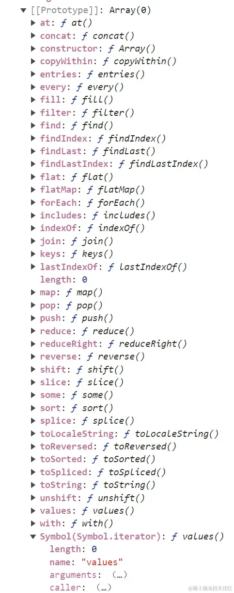

# 面试题

## 1.如何让 var [a, b] = {a: 1, b: 2} 解构赋值成功？

> 正常报错
```js
var [a, b] = {a: 1, b: 2}
// TypeError: {(intermediate value)(intermediate value)} is not iterable
```

考验的是对于`迭代器属性`的认识

```js
let arr = [1, 2, 3]
let obj = { a: 1, b: 2, c: 3 }
```

for of 只能遍历具有迭代器属性的,在遍历数组的时候会打印出1

遍历对象时会报这样的一个错误TypeError: obj is not iterable

> 数组上的迭代器属性



数组原型上有Symbol.iterator这样一个属性，这个属性显然是从Array身上继承到的，并且这个属性的值是一个函数体

```js
console.log(arr.__proto__[Symbol.iterator]());
// Object [Array Iterator] {}
```

`返回的是一个对象类型，并且是一个迭代器对象！！！`

```js
// interable
{
    [Symbol.iterator]: function () {
        return 迭代器 (可通过next()就能读取到值)
    }
}
```

得出只要一个数据结构身上，具有[Symbol.iterator]这样一个属性，且值是一个函数体，可以返回一个迭代器的话，我们就称这个数据结构是可迭代的。

```js
Object.prototype[Symbol.iterator] = function(){

}

var [a, b] = {a: 1, b: 2}
console.log(a,b);

// TypeError: Result of the Symbol.iterator method is not an object
```

可以将对象身上的迭代器，打造成和数组身上的迭代器（arr[Symbol.iterator]）一样

```js
Object.prototype[Symbol.iterator] = function(){
    // 使用 Object.values(this) 方法获取对象的所有值，并返回这些值的迭代器对象
    return Object.values(this)[Symbol.iterator]()
}
```
