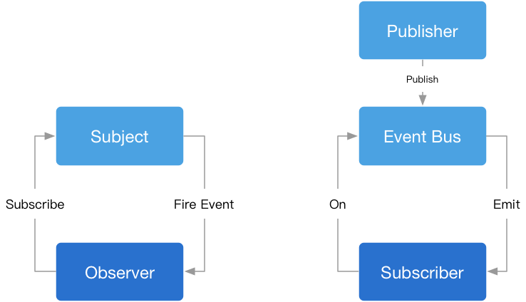

# 设计模式

## 1.目的

设计模式是为了更好的代码复用、可读、可靠、可维护。

## 2.原则-五大设计原则-SOLID

- S – Single Responsibility Principle 单一职责原则
  - 一个程序只做好一件事
  - 如果功能过于复杂就拆分开，每个部分保持独立
- O – OpenClosed Principle 开放/封闭原则
  - 对扩展开放，对修改封闭
  - 增加需求时，扩展新代码，而非修改已有代码
- L – Liskov Substitution Principle 里氏替换原则
  - 子类能覆盖父类
  - 父类能出现的地方子类就能出现
- I – Interface Segregation Principle 接口隔离原则
  - 保持接口的单一独立
  - 类似单一职责原则，这里更关注接口
- D – Dependency Inversion Principle 依赖倒转原则
  - 面向接口编程，依赖于抽象而不依赖于具体
  - 使用方只关注接口而不关注具体类的实现

## 3.类型

- 创建型
  - 单例模式
  - 工厂模式
  - 抽象工厂模式
  - 原型模式
  - 建造者模式
- 结构型
  - 适配器模式
  - 装饰器模式
  - 代理模式
  - 外观模式
  - 桥接模式
  - 组合模式
  - 享元模式
- 行为型
  - 观察者模式
  - 迭代器模式
  - 策略模式
  - 模板方法模式
  - 职责链模式
  - 命令模式
  - 备忘录模式
  - 状态模式
  - 访问者模式
  - 中介者模式
  - 解释器模式

### 3.1 单例模式 Singleton

专业解释：

单例模式是一种确保在任何情况下一个类仅有一个实例，并提供全局访问点的设计模式。它主要用于控制对全局唯一资源的访问。

通俗理解：

就好比一座城市里只有一座供水站，不论你需要从哪里取水，都只能通过这个供水站来获取，而且全市人民共用的是同一座供水站。

> 优点：

节约系统资源，对于那些需要频繁创建和销毁的对象，单例模式可以提高系统性能。

提供了全局访问点，对象间通信更简单。

> 缺点：

不适用于多线程环境，可能会引起线程安全问题。

单例对象的状态，对于依赖它的对象可能不易处理。

单例模式在系统中引入全局状态，增加了测试的复杂性。

### 3.2 工厂模式 Factory

- 简单工厂模式
- 工厂方法模式
- 抽象工厂模式

> 适用场景

- 如果你不想让某个子系统与较大的那个对象之间形成强耦合，而是想运行时从许多子系统中进行挑选的话，那么工厂模式是一个理想的选择
- 将new操作简单封装，遇到new的时候就应该考虑是否用工厂模式；
- 需要依赖具体环境创建不同实例，这些实例都有相同的行为,这时候我们可以使用工厂模式，简化实现的过程，同时也可以减少每种对象所需的代码量，有利于消除对象间的耦合，提供更大的灵活性

> 优点

- 创建对象的过程可能很复杂，但我们只需要关心创建结果。
- 构造函数和创建者分离, 符合“开闭原则”
- 一个调用者想创建一个对象，只要知道其名称就可以了。
- 扩展性高，如果想增加一个产品，只要扩展一个工厂类就可以。

> 缺点

- 添加新产品时，需要编写新的具体产品类,一定程度上增加了系统的复杂度
- 考虑到系统的可扩展性，需要引入抽象层，在客户端代码中均使用抽象层进行定义，增加了系统的抽象性和理解难度


#### 3.2.1 简单工厂模式

又叫静态工厂模式，由一个工厂对象决定创建某一种产品对象类的实例。主要用来创建同一类对象。

实际的项目中，我们常常需要根据用户的权限来渲染不同的页面，高级权限的用户所拥有的页面有些是无法被低级权限的用户所查看。

简单工厂的优点在于，你只需要一个正确的参数，就可以获取到你所需要的对象，而无需知道其创建的具体细节。但是在函数内包含了所有对象的创建逻辑（构造函数）和判断逻辑的代码，每增加新的构造函数还需要修改判断逻辑代码。当我们的对象不是上面的3个而是30个或更多时，这个函数会成为一个庞大的超级函数，便得难以维护。

> 注意: 简单工厂只能作用于创建的对象数量较少，对象的创建逻辑不复杂时使用

#### 3.2.2 工厂方法模式 Factory Method

工厂方法模式的本意是`将实际创建对象的工作推迟到子类`中，这样核心类就变成了抽象类。但是在JavaScript中很难像传统面向对象那样去实现创建抽象类。所以在JavaScript中我们只需要参考它的核心思想即可。我们可以将工厂方法看作是一个实例化对象的工厂类。

虽然ES6也没有实现abstract，但是我们可以使用 `new.target` 来模拟出抽象类。`new.target` 指向直接被new执行的构造函数，我们`对new.target进行判断，如果指向了该类则抛出错误来使得该类成为抽象类`。

在简单工厂模式中，我们每添加一个构造函数需要修改两处代码。现在我们使用工厂方法模式改造上面的代码，刚才提到，工厂方法我们只把它看作是一个实例化对象的工厂，它只做实例化对象这一件事情！

#### 3.2.3 抽象工厂模式 Abstract Factory

抽象工厂模式并不直接生成实例， 而是用于对`产品类簇的创建`。

在抽象工厂中，类簇一般用父类定义，并在父类中定义一些抽象方法，再通过抽象工厂让子类继承父类。所以，`抽象工厂其实是实现子类继承父类的方法`。

抽象方法是指声明但不能使用的方法。在其他传统面向对象的语言中常用abstract进行声明，但是在JavaScript中，abstract是属于保留字，但是我们可以通过在类的方法中抛出错误来模拟抽象类。

专业解释：

抽象工厂模式提供一个接口用于创建一系列相关或相互依赖的对象，而无需指定具体类。客户端使用此接口选择所需的产品族中的产品对象。

通俗理解：

设想一个汽车工厂不仅能生产各种类型的车（如轿车、SUV等），还能生产配套的轮胎和内饰。客户只要告诉工厂要哪种类型的车，工厂就会相应地提供整套适合的汽车部件。

### 3.3 原型模式 Prototype pattern

通俗点讲就是`创建一个共享的原型，并通过拷贝这些原型创建新的对象`。用于`创建重复的对象`，这种类型的设计模式属于创建型模式，它提供了一种创建对象的不错选择。

1. Object.create() 方法会使用指定的原型对象及其属性去创建一个新的对象。

2. 自定义实现原型模式

3. 自定义类继承

### 3.4 建造者模式 Builder

将一个复杂的对象分解成多个简单的对象来进行构建，将复杂的构建层与表现层分离，使相同的构建过程可以创建不同的表示模式

简单例子来说：当我们在外面饭店吃饭时，比如点个水煮肉片，这家店可能会辣一点、那家店可能会咸一点、对面那家可能放青菜、隔壁那家可能放菠菜，每家店做出来的都不一样，明明都是水煮肉片却有不同的做法，如果都一样就不会说这家难吃那家好吃了。那再看KFC，我们点个汉堡，所有人不管在哪个城市哪家店，做法、味道都是一样的，为什么呢，因为它用料、时间、温度等等都是严格规定的，我们只需要下订单就行了，这就是一个建造者模式。

> 建造者模式的主要角色如下：

- 产品角色（Product）：它是包含多个组成部件的复杂对象，由具体建造者来创建其各个零部件。
- 抽象建造者（Builder）：它是一个包含创建产品各个子部件的抽象方法的接口，通常还包含一个返回复杂产品的方法 getResult()。
- 具体建造者（Concrete Builder）：实现 Builder 接口，完成复杂产品的各个部件的具体创建方法。
- 指挥者（Director）：它调用建造者对象中的部件构造与装配方法完成复杂对象的创建，在指挥者中不涉及具体产品的信息。

> 1.使用场景

- 需要生成的对象具有复杂的内部结构时。
- 相同的方法，不同的执行顺序，产生不同的结果。
- 多个部件或零件，都可以装配到一个对象中，但是产生的结果又不相同。

> 2.优点

- 封装性。是客户端不必知道产品内部组成的细节。
- 建造者独立，易扩展。
- 便于控制细节风险。可以对建造过程逐步细化，而不对其他模块产生任何影响。

> 3.缺点

- 产品必须有共同点，范围有限制。
- 如果内部变化复杂，会有很多建造类。

### 3.5 适配器模式 Adapter Pattern

适配器模式是一种结构型设计模式，它允许将一个类的接口转换成客户端期望的另一个接口。适配器模式主要用于使原本由于接口不匹配而无法一起工作的两个类能够协同工作。

适配器模式涉及以下几个关键角色：

- 目标接口（Target Interface）： 客户端所期望的接口，适配器通过实现这个接口，使得客户端可以调用适配器的方法。
- 适配器（Adapter）： 实现目标接口并包装一个或多个被适配者对象，以便将调用转发给被适配者。
- 被适配者（Adaptee）： 需要被适配的类或接口，它定义了客户端不知道的方法，适配器通过调用被适配者的方法来完成适配。
- 客户端（Client）： 使用目标接口的对象，与适配器交互。

适配器模式主要有两种形式：类适配器和对象适配器。

> 优点

- 可以让任何两个没有关联的类一起运行。
- 提高了类的复用。
- 适配对象，适配库，适配数据

> 缺点

- 额外对象的创建，非直接调用，存在一定的开销(且不像代理模式在某些功能点上可实现性能优化)
- 如果没必要使用适配器模式的话，可以考虑重构，如果使用的话，尽量把文档完善

> 场景

- 整合第三方SDK
- 封装旧接口
- 当需要使用一个已经存在的类，而它的接口与你所需要的不匹配时。
- 当你想创建一个可复用的类，该类可以与其他不相关的类或不可预见的类（即接口不一致的类）协同工作时。
- 适配器模式使得不同接口的类能够协同工作，使系统更加灵活，同时能够保持类的独立性和可复用性。

### 3.6 装饰器模式 Decorator Pattern

装饰器模式允许动态地给对象添加新的行为，而不需要修改对象的原始代码。在装饰器模式中，我们定义一个装饰器对象，它包含一个原始对象，并且实现了与原始对象相同的接口。我们可以使用装饰器对象来给原始对象添加新的行为，同时也可以在不改变原始对象的前提下，使用不同的装饰器组合来达到不同的效果。

> 意图: 动态地给一个对象添加额外的职责，同时不改变其结构。装饰器模式提供了一种灵活的替代继承方式来扩展功能。

> 优点
- 可以动态地添加新的行为，而不需要修改原始对象的代码。
- 可以使用多个装饰器组合，从而达到不同的效果。
- 遵循开闭原则，允许在不改变现有代码的情况下扩展系统功能。

> 缺点
- 如果装饰器的数量太多，可能会导致代码复杂度增加，降低代码的可读性和可维护性。
- 如果装饰器的使用不当，可能会导致对象状态的混乱和不一致。

> 适用场景
- 当需要动态地给对象添加新的行为，同时又需要保持原始对象的不变性时。
- 当需要在运行时动态地添加或移除对象的功能时。
- 当需要通过组合不同的装饰器来实现不同的效果时。

> 在装饰者模式中，有几个关键角色
- 组件接口（Component）： 定义了具体组件和装饰者共用的接口，确保它们是可互换的。
- 具体组件（Concrete Component）： 实现了组件接口，是被装饰的原始对象。
- 装饰者（Decorator）： 实现了组件接口并持有一个具体组件的引用，在其上可以添加额外的行为。
- 具体装饰者（Concrete Decorator）： 扩展了装饰者接口，实现了具体的装饰行为。

在TypeScript中装饰器可以修饰4种语句：类,方法,方法参数,属性。

> 执行顺序

1. 有多个参数装饰器时：从最后一个参数依次向前执行
2. 方法和方法参数中参数装饰器先执行。
3. 类装饰器总是最后执行。
4. 方法和属性装饰器，谁在前面谁先执行。因为参数属于方法一部分，所以参数会一直紧紧挨着方法执行。

```js

/**
 * 类装饰器
 * @param path
 * @returns
 */
function Path(path: string) {
  return function (target: Function) {
    !target.prototype.$Meta && (target.prototype.$Meta = {});
    target.prototype.$Meta.baseUrl = path;
  };
}

/**
 * 类成员装饰器
 * @param {*} target 被修饰的类的原型对象
 * @param {*} name 类成员的名字
 * @param {*} descriptor 类成员的描述对象
 * @returns
 */
function readonly(target, name, descriptor) {
  descriptor.writable = false;
  return descriptor;
}

/**
 * 方法装饰器
 * @param url
 * @returns
 */
function GET(url: string) {
  return function (target, methodName: string, descriptor: PropertyDescriptor) {
    !target.$Meta && (target.$Meta = {});
    target.$Meta[methodName] = url;
  };
}

/**
 * 方法参数装饰器
 * @param paramName
 * @returns
 */
function PathParam(paramName: string) {
  return function (target, methodName: string, paramIndex: number) {
    !target.$Meta && (target.$Meta = {});
    target.$Meta[paramIndex] = paramName;
  };
}

/**
 * 属性装饰器
 * @param value
 * @returns
 */
function DefaultValue(value: string) {
  return function (target: any, propertyName: string) {
    target[propertyName] = value;
  };
}
```

### 3.7 代理模式 Proxy Pattern

代理模式（Proxy Pattern）是一种结构型设计模式，其主要目的是通过引入一个代理对象来控制对另一个对象的访问。代理对象充当了客户端和目标对象之间的中介，可以用于实现各种用途，如延迟加载、权限控制、日志记录等。

> 代理模式涉及到以下几个角色：

- 抽象主题（Subject）： 定义了目标对象和代理对象的共同接口，客户端通过该接口访问目标对象。
- 具体主题（Real Subject）： 实现了抽象主题接口，是真正的目标对象，代理对象直接控制对它的访问。
- 代理（Proxy）： 实现了抽象主题接口，保存了对真正目标对象的引用，客户端通过代理访问目标对象。代理对象可以在客户端访问目标对象之前或之后执行一些额外的操作。

> 代理模式可以分为多种类型

- 静态代理（Static Proxy）： 代理对象在编译时就已经确定，代理类和目标类的关系在编译阶段就确定了。静态代理需要为每一个目标类创建一个代理类，导致类的数量增加。
- 动态代理（Dynamic Proxy）： 代理对象在运行时动态生成，代理类不需要预先定义，而是在运行时根据需要创建。Java 中的 java.lang.reflect.Proxy 和 InvocationHandler 接口就是动态代理的经典实现。

### 3.8 外观模式 Facade Pattern

外观模式（Facade Pattern）是一种结构型设计模式，它提供了一个统一的接口，用于访问子系统中的一群接口。外观模式定义了一个高层接口，使得子系统更容易使用。

外观模式的主要目的是简化客户端与复杂系统之间的交互，通过引入一个外观类，隐藏了系统的复杂性，使得客户端只需与外观类交互，而无需直接与子系统中的各个组件打交道。这有助于减少客户端与子系统之间的依赖关系，提高了系统的灵活性和可维护性。

> 外观模式涉及到以下几个角色：

- 外观（Facade）： 提供了一个高层次的接口，该接口使用了子系统中的一群接口，使得子系统更容易使用。
- 子系统（Subsystems）： 由多个类组成，实现了系统的各个功能。外观将客户端请求代理给适当的子系统对象。
- 客户端（Client）： 通过外观接口与子系统交互，而无需直接与子系统的具体实现打交道。

>应用场景
- 维护设计粗糙和难以理解的遗留系统，或者系统非常复杂的时候，可以为这些系统设置外观模块，给外界提供清晰的接口，以后新系统只需与外观交互即可。
- 你写了若干小模块，可以完成某个大功能，但日后常用的是大功能，可以使用外观来提供大功能，因为外界也不需要了解小模块的功能。
- 团队协作时，可以给各自负责的模块建立合适的外观，以简化使用，节约沟通时间。 如果构建多层系统，可以使用外观模式来将系统分层，让外观模块成为每层的入口，简化层间调用，松散层间耦合。

>优点
- 访问者不需要再了解子系统内部模块的功能，而只需和外观交互即可，使得访问者对子系统的使用变得简单，符合最少知识原则，增强了可移植性和可读性；
- 减少了与子系统模块的直接引用，实现了访问者与子系统中模块之间的松耦合，增加了可维护性和可扩展性；
- 通过合理使用外观模式，可以帮助我们更好地划分系统访问层次，比如把需要暴露给外部的功能集中到外观中，这样既方便访问者使用，也很好地隐藏了内部的细节，提升了安全性；

>缺点
- 不符合开闭原则，对修改关闭，对扩展开放，如果外观模块出错，那么只能通过修改的方式来解决问题，因为外观模块是子系统的唯一出口；
- 不需要或不合理的使用外观会让人迷惑，过犹不及；

### 3.9 桥接模式 Bridge Pattern

桥接模式（Bridge Pattern）是一种结构型设计模式，它将抽象部分与实现部分分离，使它们可以独立变化，而不影响彼此。桥接模式主要用于处理具有多层次继承结构的情况，通过将抽象部分和实现部分分开，使得系统更加灵活。

> 在桥接模式中，有两个关键的角色：

- 抽象类（Abstraction）： 定义了抽象部分的接口，并维护一个指向实现部分的引用。
- 实现类（Implementor）： 定义了实现部分的接口，被抽象类引用。
- 具体抽象类（Concrete Abstraction）： 继承自抽象类，实现抽象类定义的接口。
- 具体实现类（Concrete Implementor）： 继承自实现类，实现实现类定义的接口。

> 优点
- 分离了抽象和实现部分，将实现层（DOM 元素事件触发并执行具体修改逻辑）和抽象层（ 元素外观、尺寸部分的修改函数）解耦，有利于分层；
- 提高了可扩展性，多个维度的部件自由组合，避免了类继承带来的强耦合关系，也减少了部件类的数量；
- 使用者不用关心细节的实现，可以方便快捷地进行使用；

> 缺点
- 桥接模式要求两个部件没有耦合关系，否则无法独立地变化，因此要求正确的对系统变化的维度进行识别，使用范围存在局限性；
- 桥接模式的引入增加了系统复杂度；

> 适用场景
- 一个类存在两个以上独立变化的维度，且这些类都要进行拓展。
- 多层次的继承关系导致子类急剧增加
- 抽象化类和具体化类之间想要增加更多的灵活性

### 3.10 组合模式 Composite Pattern

组合模式（Composite Pattern）是一种结构型设计模式，它允许你将对象组合成树形结构以表示"部分-整体"的层次结构。组合模式使得客户端对单个对象和组合对象的使用具有一致性。

> 在组合模式中，有两种关键角色：
1. 组件（Component）： 定义了树形结构中所有具体对象和组合对象的共同接口。
2. 叶子（Leaf）： 实现了组件接口的叶子对象，它是树中的叶子节点，没有子节点。
3. 合成（Composite）： 实现了组件接口的组合对象，它具有叶子和其他组合对象作为子节点，可以递归地组合成更复杂的树形结构。

> 应用场景
- 优化处理递归或分级数据结构（文件系统 - 目录文件管理）；
- 与其它设计模式联用，如与命令模式联用实现 “宏命令”。

> 优点
- 忽略组合对象和单个对象的差别，对外一致接口使用；
- 解耦调用者与复杂元素之间的联系，处理方式变得简单。

> 缺点
- 树叶对象接口一致，无法区分，只有在运行时方可辨别；
- 包裹对象创建太多，额外增加内存负担。

### 3.11 享元模式 Flyweight Pattern

享元模式（Flyweight Pattern）是一种结构型设计模式，旨在通过共享对象来减少内存和计算开销。该模式适用于系统中存在大量相似对象，它通过共享这些对象的相同部分，减少了实例的数量，从而降低了内存占用和提高了性能。

> 在享元模式中，存在两种类型的状态：

内部状态（Intrinsic State）： 内部状态是对象可共享的部分，它存储在享元对象内部并且不会随环境的改变而改变。对于所有共享对象，内部状态是一致的。
外部状态（Extrinsic State）： 外部状态是对象依赖的、随环境改变而改变的部分。它不可共享，需要在使用享元对象时由客户端传递给享元对象。

享元模式的关键是将对象的状态分为内部状态和外部状态，并尽可能共享内部状态。

> 应用场景
- 对象的大多数状态都可以变为外部状态
- 一个程序中使用了大量的相似对象
- 由于使用了大量对象，造成很大的内存开销
- 剥离出对象的外部状态之后，可以用相对较少的共享对象取代大量对象

### 3.12 观察者模式 Observer Pattern & 订阅发布模式 Pub-Sub Pattern

#### 3.12.1 观察者模式 Observer Pattern

观察者模式（Observer Pattern）：定义对象间的一种一对多依赖关系，使得每当一个对象状态发生改变时，其相关依赖对象皆得到通知并被自动更新。

所谓观察者模式，其实就是为了实现 `松耦合`（Loosely Coupled）。

举个例子，当数据有更新，如 changed 方法被调用，用于更新 state 数据，比如温度、气压等。

这些的问题是，如果向更新更多的信息，比如说湿度，那就要去修改 changed 方法的代码，这就是紧耦合的坏处。

对于观察者模式，我们仅仅维护一个可观察对象即可，即一个 Observable 实例，当有数据变更时，它只需维护一套观察者（Observer）的集合，这些 Observer 实现相同的接口，Subject 只需要指导，通知 Observer 时，需要调用哪个同一方法就好了。

> 观察者模式包含如下角色

- Subject（目标）：知道它的通知对象，事件发生后会通知所有它知道的对象，提供添加删除观察者的接口。
- ConcreteSubject（具体目标）：被观察者具体的实例，存储观察者感兴趣的状态。
- Observer（观察者）：提供通知后的更新事件。
- ConcreteObserver（具体观察者）：被观察者具体的实例，存储观察者感兴趣的状态。

> 优点
- 支持简单的广播通信，自动通知所有已经订阅过的对象
- 目标对象与观察者之间的抽象耦合关系能单独扩展以及重用
- 增加了灵活性
- 观察者模式所做的工作就是在解耦，让耦合的双方都依赖于抽象，而不是依赖于具体。从而使得各自的变化都不会影响到另一边的变化。

> 缺点
- 过度使用会导致对象与对象之间的联系弱化，会导致程序难以跟踪维护和理解

> 应用场景
- DOM事件
- vue响应式

#### 3.12.2 订阅发布模式 Pub-Sub Pattern

订阅发布模式（Pub-Sub Pattern）属于广义上的观察者模式

发布订阅模式是最常用的一种观察者模式的实现，并且从解耦和重用角度来看，更优于典型的观察者模式。



> 完成订阅发布整个流程需要三个角色
- 发布者
- 事件中心
- 订阅者

以事件为例，简单流程如下：

发布者->事件中心<=>订阅者，订阅者需要向事件中心订阅指定的事件 -> 发布者向事件中心发布指定事件内容 -> 事件中心通知订阅者 -> 订阅者收到消息（可能是多个订阅者），到此完成了一次订阅发布的流程。

- 在观察者模式中，观察者需要直接订阅目标事件；在目标发出内容改变的事件后，直接接收事件并作出响应。
- 在发布订阅模式中，发布者和订阅者之间多了一个发布通道；一方面从发布者接收事件，另一方面向订阅者发布事件；订阅者需要从事件通道订阅事件。

> 应用场景
- EventEmitter
- node 的 events

订阅者在订阅事件的时候，只关注事件本身，而不关心谁会发布这个事件；发布者在发布事件的时候，只关注事件本身，而不关心谁订阅了这个事件。

#### 3.12.3 订阅发布模式和观察者模式的区别

> 角色角度来看
- 订阅发布模式需要三种角色，发布者、事件中心和订阅者。而观察者模式需要两种角色，目标和观察者，无事件中心负责通信。

> 从耦合度上来看
- 订阅发布模式是一个事件中心调度模式，订阅者和发布者是没有直接关联的，通过事件中心进行关联，两者是解耦的。而观察者模式中目标和观察者是直接关联的，耦合在一起（有些观念说观察者是解耦，解耦的是业务代码，不是目标和观察者本身）。

> 订阅发布模式优点
- 灵活
- 由于订阅发布模式的发布者和订阅者是解耦的，只要引入订阅发布模式的事件中心，无论在何处都可以发布订阅。同时订阅发布者相互之间不影响。
- 订阅发布模式在使用不当的情况下，容易造成数据流混乱，所以才有了 React 提出的单项数据流思想，就是为了解决数据流混乱的问题。

> 订阅发布模式缺点
- 容易导致代码不好维护
- 灵活是有点，同时也是缺点，使用不当就会造成数据流混乱，导致代码不好维护。
- 性能消耗更大
- 订阅发布模式需要维护事件列队，订阅的事件越多，内存消耗越大。

> 观察者模式优点
- 响应式
- 目标变化就会通知观察者，这是观察者最大的有点，也是因为这个优点，观察者模式在前端才会这么出名。

> 观察者模式缺点
- 不灵活
- 相比订阅发布模式，由于目标和观察者是耦合在一起的，所以观察者模式需要同时引入目标和观察者才能达到响应式的效果。而订阅发布模式只需要引入事件中心，订阅者和发布者可以不再一处。

### 3.13 迭代器模式 Iterator Pattern

提供一种方法顺序一个聚合对象中各个元素，而又不暴露该对象的内部表示。

> 迭代器的实现
- 定义迭代器接口: 迭代器模式的核心是定义一个迭代器接口，该接口包含两个方法：next和hasNext。next方法返回序列中的下一个元素，而hasNext方法检查序列是否还有元素。
- 实现迭代器 :要实现一个迭代器，可以创建一个包含内部指针和next方法的对象。next方法返回序列中的下一个元素，并更新内部指针。如果序列中没有更多的元素，则返回空。
- 使用迭代器 :一旦有了迭代器，就可以通过调用next方法和检查hasNext方法来遍历序列。例如，可以遍历数组中的所有元素

> 优点
- 迭代器模式的一个主要优点是它提供了一种灵活的、统一的方式来访问序列中的元素。这意味着可以轻松地在不同的序列上执行相同的操作，从而减少了代码的复杂性。另外，迭代器模式还可以隐藏序列的实现细节，并提供对序列顺序的控制。

> 缺点
- 尽管迭代器模式提供了很多好处，但也存在一些缺点。首先，实现迭代器需要一些额外的代码，这可能会增加应用程序的复杂性。此外，许多现代浏览器都支持迭代器，但是一些旧的浏览器可能不支持此API。

迭代器模式是一种非常有用的模式，尤其是在处理大型数据集时。它提供了一种灵活的、统一的方式来访问序列中的元素。虽然它可能需要一些额外的代码来实现，但是这些成本可以通过减少代码的复杂性和隐藏序列的实现细节来弥补。

### 3.14 策略模式 Strategy Pattern

策略模式（Strategy Pattern）：定义一系列算法，将每一个算法封装起来，并让它们可以相互替换。策略模式让算法独立于使用它的客户而变化，也称为政策模式（Policy）。

- 解决问题：在有多种算法相似的情况下，使用 if...else 所带来的复杂和难以维护，缺乏弹性（扩展性差），复用性差
- 何时使用：一个系统有许多许多类，而区分它们的只是他们直接的行为
- 如何解决：将这些算法封装成一个一个的类，任意地替换
- 核心代码：实现同一个接口
- 应用实例：
  - 诸葛亮的锦囊妙计，每一个锦囊就是一个策略
- 优点：
  - 算法可以自由切换
  - 避免使用多重条件判断
  - 扩展性良好
- 缺点：
  - 策略类会增多
  - 所有策略类都需要对外暴露

> 应用场景
- 如果在一个系统里面有许多类，它们之间的区别仅在于它们的行为，那么使用策略模式可以动态地让一个对象在许多行为中选择一种行为。
- 一个系统需要动态地在几种算法中选择一种。
- 如果一个对象有很多的行为，如果不用恰当的模式，这些行为就只好使用多重的条件选择语句来实现。

> 策略模式包含如下角色
- Context（环境类）：持有一个 Strategy 类的引用，用一个 ConcreteStrategy 对象来配置。
- Strategy（抽象策略类）：定义所有支持的算法的公共接口。通常是以一个接口或抽象来实现，Context 使用这个接口来调用其 ConcreteStrategy 定义的算法。
- ConcreteStrategy（具体策略类）：以 Strategy 接口实现某具体算法。

策略模式的使用，可以避免过多的 if-else 判断，也可以替代简单逻辑的 switch

```js
const formatDemandItemType = value => {
  switch (value) {
    case 0:
      return '初级';
    case 1:
      return '中级';
    case 2:
      return '高级';
  }
};

const formateDemandItemType = value => {
  const enum = {
    0: '初级',
    1: '中级',
    2: '高级',
  };
};
```

### 3.15 模板方法模式 TemplateMethod Pattern

模板方法模式由两部分结构组成，第一部分是抽象父类，第二部分是具体的实现子类。通常在抽象父类中封装了子类的算法框架，包括实现一些公共方法和封装子类中所有方法的执行顺序。子类通过继承这个抽象类，也继承了整个算法结构，并且可以选择重写父类的方法。

- 解决问题：一些方法通用，却在每一个子类都重新写了这一方法
- 何时使用：有一些通用的方法
- 如何解决：将这些通用算法抽象出来
- 核心代码：在抽象类实现，其他步骤在子类实现
- 应用实例：
  - 在造房子的时候，地基、走线、水管都一样，只有在建筑的后期才有加壁橱加栅栏等差异
  - 西游记里面菩萨定好的 81 难，这就是一个顶层的逻辑骨架
  - Spring 中对 Hibernate 的支持，将一些已经定好的方法封装起来，比如开启事务、获取 Session、关闭 Session 等，程序员不重复写那些已经规范好的代码，直接丢一个实体就可以保存
- 优点：
  - 封装不变部分，扩展可变部分
  - 提取公共代码，便于维护
  - 行为由父类控制，子类实现
- 缺点：
  - 每一个不同的实现都需要一个子类来实现，导致类的个数增加，使得系统更加庞大
- 使用场景：
  - 有多个子类共有的方法，且逻辑相同
  - 重要的、复杂的方法，可以考虑作为模板方法

> 模板模式包含如下角色：
- 抽象父类：封装子类的算法框架，包括实现一些公用方法以及封装在子类中所有方法的执行顺序
- 实现子类：通过集成这个抽象类，也继承了整个算法，并且可以选择重写父类的方法 假如我们有许多平行的类，各个类之间有许多相同的行为，也有部分不同的行为。如果各位都定义自己所有的行为，那么会出现很多重复的方法。此时可以将相同的行为搬移到另外一个单一的地方，模板方法模式就是为了解决这个问题。在模板方法模式中，子类中相同的行为被移动到了父类中，而将不同的部分留待子类来实现。

### 3.16 职责链模式 Chain of Responsibility Pattern

职责链模式（Chain of Responsibility）：解决请求的发送者和请求的接受者之间的耦合，通过职责链上的多个对象对分解请求流程，实现请求在多个对象之间的传递，直到有对象处理它为止。

- 解决问题：职责链上的处理者负责处理请求，客户只需要将请求发送到职责链上即可，无须关心请求的处理细节和请求的传递，所以职责链将请求的发送者和请求的处理者解耦了。
- 何时使用：在处理消息的时候以过滤很多道
- 如何解决：拦截的类都实现统一接口
- 核心代码：Handler 里面聚合它自己，在 HandlerRequest 里判断是否合适，如果没达到条件则向下传递，向谁传递之前 set 进去。
- 应用实例：
  - 如果早高峰能顺利挤上公交车的话，那么估计这一天都会过得很开心。因为公交车上人实在太多了，经常上车后却找不到售票员在哪，所以只好把两块钱硬币往前面递。除非你运气够好，站在你前面的第一个人就是售票员，否则，你的硬币通常要在 N 个人手上传递，才能最终到达售票员的手里。
  - 中学时代的期末考试，如果你平时不太老实，考试时就会被安排在第一个位置。遇到不会答的题目，就把题目编号写在小纸条上往后传递，坐在后面的同学如果也不会答，他就会把这张小纸条继续递给他后面的人。
- 优点：
  - 降低耦合度。它将请求的发送者和接收者解耦。
  - 简化对象。使得对象不需要知道链的结构。
  - 增强给对象指派职责的灵活性。通过改变链内的成员活着调动它们的次序，允许动态地新增活着删除责任。
  - 增加新的请求处理类很方便
- 缺点：
  - 不能保证请求一定被接收
  - 系统性能将受到一定影响，而且在进行代码调试时不太方便，可能会造成循环调用
  - 可能不容易观察运行时的特征，有碍于除错
- 使用场景：
  - 有多个对象可以处理同一个请求，具体哪个对象处理该请求由运行时刻自动确定
  - 在不明确指定接收者的情况下，向多个对象中的一个提交一个请求
  - 可动态指定一组对象处理请求

> 职责链模式包含如下角色
- 抽象处理者（Handler）：定义一个处理请求的抽象类。如果需要，可以定义一个方法以设定返回对下家的引用。
- 具体处理者（ConcreteHandler）：具体处理者接到请求后，可以选择将请求处理掉，或者将请求传给下家。由于具体处理者持有对下家的引用，因此，如果需要，具体处理者可以访问下家。

### 3.17 命令模式 Command Pattern

命令模式（Command Pattern）：将一个请求封装为一个对象，从而使我们可用不同的请求对客户进行参数化；对请求排队或者记录请求日志，以及支持可撤销的操作。命令模式是一种对象行为型模式，其别名为动作（Action）模式或事务（Transaction）模式。

命令模式允许将功能请求封装为独立的对象，并根据需要将其排队、记录、撤销或重做。该模式的核心是将请求与其调用者分离，从而使命令对象独立于发送者和接收者。

- 解决问题：在软件系统中，行为请求者与行为实现者通常是一种紧耦合的关系，但某些场合，比如需要对行为进行记录、撤销或重做、事务等处理时，这种无法抵御变化的紧耦合的设计就不太合适。
- 何时使用：在某些场合，比如要对行为进行"记录、撤销/重做、事务"等处理，这种无法抵御变化的紧耦合是不合适的。在这种情况下，如何将"行为请求者"与"行为实现者"解耦？将一组行为抽象为对象，可以实现二者之间的松耦合。
- 如何解决：通过调用者调用接受者执行命令，顺序：调用者→接受者→命令。
- 核心代码：定义三个角色：1、received 真正的命令执行对象 2、Command 3、invoker 使用命令对象的入口

- 优点：
  - 降低耦合度
  - 新的命令可以很容易添加到系统中去
- 缺点：
  - 使用命令模式可能会导致某些系统有过多的具体命令类
- 使用场景：
  - 认为是命令的地方都可以使用命令模式
    - GUI 中每一个按钮都是一条命令
    - 模拟 CMD

> 职责链模式包含如下角色
- Command（抽象命令类）
- ConcreteCommand（具体命令类）
- Invoker（调用者）
- Receiver（接收者）
- Client（客户类）

### 3.18 备忘录模式 Memento Pattern

备忘录模式是一种行为型设计模式，它允许在不暴露对象实现细节的情况下，捕获和存储对象的内部状态，并在需要时恢复状态。该模式通过在不破坏封装的前提下，提供了对象状态管理的灵活性。在JavaScript中，备忘录模式常常用于实现撤销（undo）操作、缓存（cache）和历史记录（history）等功能。

> 备忘录模式包含以下几个角色
- Originator（原发器）：负责创建一个备忘录，并记录自身状态，也可使用备忘录恢复自身状态。
- Memento（备忘录）：存储Originator的内部状态，可以包含Originator需要保存的状态信息。
- Caretaker（管理者）：负责保存备忘录对象，但不能对备忘录的内容进行操作或检查。

- 本质：保存和恢复内部状态
- 优点
  - 提供了一种保存和恢复对象状态的方式，使得对象的状态管理更加灵活。
  - 可以实现撤销和重做功能，提升用户体验。
  - 不破坏封装性，保持了对象的内部状态的私有性。
- 缺点
  - 如果备忘录对象过多或者状态较大，会占用较大的内存空间。
  - 备忘录模式会增加代码复杂度，需要额外维护备忘录对象和原始对象之间的关系。

### 3.19 状态模式 State Pattern

状态模式（State Pattern）：允许一个对象在其内部状态改变时改变它的行为，对象看起来似乎修改了它的类。其别名为状态对象（Objects for States），状态模式是一种对象行为型模式。

- 解决问题：对象的行为依赖于它的状态（属性），并且可以根据它的状态改变而改变它的相关行为
- 何时使用：代码中包含大量与对象状态有关的条件语句
- 如何解决：将各种具体的状态类抽象出来
- 核心代码：通常命令模式的接口中只有一个方法。而状态模式的接口中有一个或者多个方法。而且，状态模式的实现类的方法，一般返回值，或者是改变实例变量的值。也就是说，状态模式一般和对象的状态有关。实现类的方法有不同的功能，覆盖接口中的方法。状态模式和命令模式一样，也可以用于消除 if...else 等条件选择语句。
- 应用实例：
- 打篮球的时候运动员可以有正常状态、不正常状态和超常状态。
- 优点：
  - 封装了转换规则
  - 枚举可能的状态，在枚举状态之前需要确定状态种类
  - 将所有与某个状态有关的行为放到一个类中，并且可以方便地增加新的状态，只需要改变对象状态即可改变对象的行为
  - 允许状态转换逻辑与状态对象合成一体，而不是某一个巨大的条件语句块
  - 可以让多个环境对象共享一个状态对象，从而减少系统中对象的个数
- 缺点：
  - 状态模式的使用必然会增加系统类和对象的个数。
  - 状态模式的结构与实现都较为复杂，如果使用不当将导致程序结构和代码的混乱。
  - 状态模式对“开闭原则”的支持并不太好，对于可以切换状态的状态模式，增加新的状态类需要修改那些负责状态转换的源代码，否则无法切换到新增状态，而且修改某个状态类的行为也需修改对应类的源代码。
- 使用场景：
  - 行为随状态改变而改变的场景
  - 条件、分支语句的代替者

> 状态模式包含如下角色
- Context（环境类）：定义客户端所感兴趣的接口，并且保留一个具体状态类的实例。这个具体状态类的实例给出此环境对象的现有状态。
- State（抽象状态类）：定义一个接口，用以封装环境（Context）对象的一个特定的状态所对应的行为。
- ConcreteState（具体状态类）：每一个具体状态类都实现了环境（Context）的一个状态所对应的行为。

### 3.20 访问者模式 Visitor Pattern

访问者模式（Visitor Pattern）是一种行为型模式，它能够再不修改现有类结构的前提下，增加新的操作。这种模式的主要意图是通过使用访问者来表示执行这些操作的新方法。

> 实现访问者模式需要以下几个角色
- 访问者(Visitor)角色：定义了对每个元素访问的操作，也就是对应于对象结构中具体元素类的操作。
- 具体访问者(ConcreteVisitor)角色：实现了访问者角色中定义的方法，具体实现了对元素的操作。
- 元素(Element)角色：定义了一个接受访问者的方法，这个方法的参数就是访问者对象。
- 具体元素(ConcreteElement)角色：实现了元素角色中定义的接受访问者的方法，通常情况下，具体元素角色会调用访问者角色中的方法。
- 对象结构(Object Structure)角色：这是一个包含元素角色对象的容器，可以遍历容器中的所有元素，通常会提供一个接收访问者的方法。

> 应用场景
- DOM 操作：在浏览器中，DOM（文档对象模型）表示网页的结构和内容。使用访问者模式，您可以定义一个访问者对象，该对象可以遍历 DOM 树的节点，并执行相应的操作。例如，可以创建一个访问者来查找特定类型的节点、修改节点属性或样式，或执行其他与 DOM 相关的操作。
- 数据结构操作：JavaScript 中有许多内置的数据结构，如数组、集合、映射等。通过使用访问者模式，您可以定义一个访问者对象，来对这些数据结构进行遍历和操作。例如，可以创建一个访问者来计算数组中的总和、过滤符合特定条件的元素，或者将映射转换为另一种形式。
- 编译器和解析器：在编译器和解析器中，访问者模式经常被用来处理抽象语法树（AST）。通过定义访问者对象，可以遍历 AST 并执行各种语义分析、优化或代码生成操作。这样可以将复杂的编译器逻辑分离到不同的访问者方法中，使其更易于维护和扩展。
- 事件处理：在浏览器中，事件处理是非常常见的任务。访问者模式可以用于处理不同类型的事件，并执行相应的操作。例如，可以创建一个访问者来处理鼠标事件、键盘事件或其他用户交互事件。
数据校验和验证：当需要对数据进行复杂的校验和验证时，访问者模式可以提供一种结构化的方法。您可以定义一个访问者对象，该对象遍历数据结构并执行各种校验逻辑。这样可以将校验逻辑从数据结构中分离出来，使其更加可维护和可扩展。

- 优点
  - 分离关注点：访问者模式将数据结构和操作分离开来，使得操作可以独立变化，而不影响数据结构。
  - 增加新操作：通过添加新的访问者，我们可以轻松地增加新的操作，而无需修改现有元素类。
  - 灵活性：访问者模式允许我们在不修改元素类的情况下对其进行扩展和修改。
- 缺点
  - 增加新元素困难：当需要添加新的元素类时，需要修改所有现有的访问者类。
  - 违反开闭原则：当增加新操作时，需要修改所有现有的元素类。

### 3.21 中介者模式 Mediator Pattern

定义: 对象和对象之间借助第三方中介者进行通信。

中介者模式是一种行为型设计模式，它允许对象之间相互交互，而不必直接相互依赖。在这个模式中，对象通过一个中介者对象来协调彼此之间的通信。中介者模式能够降低对象之间的耦合度，使系统更易于维护和扩展。

中介者模式(Mediator Pattern)是定义了一个中介对象来封装一系列的对象交互。中介者使各对象不需要显示的相互引用，从而使其耦合性松散，而且可以独立地改变它们之间的交互。

> 中介者模式包含以下几个部分
- 中介者（Mediator）：定义了各个同事对象之间交互的接口，并负责协调各个同事之间的关系。
- 具体中介者（Concrete Mediator）：实现中介者接口，协调各个同事之间的关系。
- 同事对象（Colleague）：定义了各个同事对象之间交互的接口，每个同事对象都知道中介者对象。
- 具体同事对象（Concrete Colleague）：实现同事接口，每个同事对象都会与其他同事对象交互，但是只与中介者对象交互。

需要注意的是，在中介者模式中，同事对象并不直接相互引用，而是通过中介者对象进行通信，这样可以使得对象之间的耦合度降低，从而使得代码更加灵活、易于维护和扩展。同时，由于中介者对象负责协调对象之间的交互，因此它可以提高代码的可读性和可维护性。

- 应用场景
  - 系统中对象之间存在比较复杂的引用关系，导致它们之间的依赖关系结构混乱而且难以复用该对象。
  - 想通过一个中间类来封装多个类中的行为，而又不想生成太多的子类。
- 优点
  - 降低了类的复杂度，将一对多转化成了一对一
  - 各个类之间的解耦
  - 符合迪米特原则
- 缺点
  - 中介者会庞大，变得复杂难以维护

### 3.22 解释器模式 Interpreter Pattern

给定一个语言，定义它的文法的一种表示，并定义一个解释器，这个解释器使用该表示来解释语言中的句子。

- 本质
  - 分离实现，解释执行
- 优点
  - 易于扩展和修改文法规则。增加时只需要增加新的终结符表达式，符合开关原则。
- 缺点：
  - 对于复杂文法难以维护，会充满非终结表达式。
  - 执行效率低，由于使用了大量循环和递归调用，在解释复杂句子时速度很慢。
- 适用场景：
  - 可以将一个需要解释执行的语言中的句子表示为一个抽象语法树
  - 一些重复出现的问题可以用一种简单的语言来进行表达
  - 一个语言文法较为简单
  - 执行效率不是关键问题

解释器即是对客户提出的需求，经过解析而形成的一个抽象解释程序。而是否可以应用解释器模式的一条重要准则是能否更根据需求解析出一套完整的语法规则，无论语法规则简单或是复杂都是必须的。因为解释器要按照这套规则才能实现相应的功能。

JavaScript解释器模式是一种将代码解释为可执行对象的设计模式，它可以使代码更加灵活和易于维护。在JavaScript中，解释器模式通常用于解析和执行动态生成的代码、解析表达式、实现DSL等场景。
