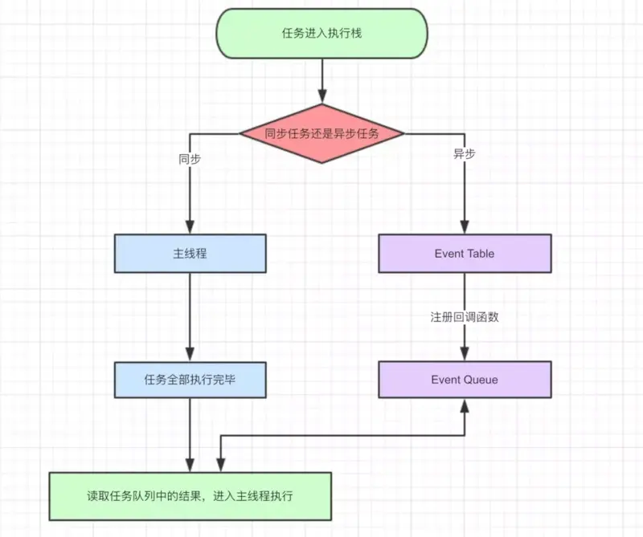

# 7.事件队列

## 为什么 JavaScript 是单线程？

JavaScript 语言的一大特点就是`单线程`，也就是说，同一个时间只能做一件事。那么，为什么 JavaScript 不能有多个线程呢？这样能提高效率啊。

JavaScript 的单线程，与它的用途有关。作为浏览器脚本语言，JavaScript 的主要用途是与用户互动，以及操作 DOM。这决定了它`只能是单线程，否则会带来很复杂的同步问题`。比如，假定 JavaScript 同时有两个线程，一个线程在某个 DOM 节点上添加内容，另一个线程删除了这个节点，这时浏览器应该以哪个线程为准？

所以，为了`避免复杂性`，从一诞生，JavaScript 就是单线程，这已经成了这门语言的核心特征，将来也不会改变。

为了利用多核 CPU 的计算能力，HTML5 提出 Web Worker 标准。允许 JavaScript 脚本创建多个线程，但是子线程完全受主线程控制，且不得操作 DOM。所以，这个新标准并没有改变 JavaScript 单线程的本质。

## 事件循环 (Event Loop)

浏览器或Node的一种解决javaScript单线程运行时不会阻塞的一种机制，也就是我们经常使用异步的原理

### 堆，栈、队列

#### 堆（Heap）

堆是一种数据结构，是利用完全二叉树维护的一组数据，堆分为两种，一种为最大堆，一种为最小堆，将根节点最大的堆叫做最大堆或大根堆，根节点最小的堆叫做最小堆或小根堆。
堆是线性数据结构，相当于一维数组，有唯一后继。

#### 栈（Stack） 先进后出

栈在计算机科学中是限定仅在表尾进行插入或删除操作的线性表。 栈是一种数据结构，它按照后进先出的原则存储数据，先进入的数据被压入栈底，最后的数据在栈顶，需要读数据的时候从栈顶开始弹出数据。

栈是只能在某一端插入和删除的特殊线性表。

#### 队列（Queue）先进先出

特殊之处在于它只允许在表的前端（front）进行删除操作，而在表的后端（rear）进行插入操作，和栈一样，队列是一种操作受限制的线性表。

进行插入操作的端称为队尾，进行删除操作的端称为队头。  队列中没有元素时，称为空队列。

队列的数据元素又称为队列元素。在队列中插入一个队列元素称为入队，从队列中删除一个队列元素称为出队。因为队列只允许在一端插入，在另一端删除，所以只有最早进入队列的元素才能最先从队列中删除，故队列又称为先进先出（FIFO—first in first out）

### Event Loop

在JavaScript中，任务被分为两种，一种`宏任务`（MacroTask）也叫Task，一种叫`微任务`（MicroTask）。

1. MacroTask（宏任务）

- script全部代码、setTimeout、setInterval、setImmediate（浏览器暂时不支持，只有IE10支持，具体可见MDN）、I/O、UI Rendering。

2. MicroTask（微任务）

- Process.nextTick（Node独有）、Promise、Object.observe(废弃)、MutationObserver

### 浏览器中的Event Loop

Javascript 有一个 main thread 主线程和 call-stack 调用栈(执行栈)，所有的任务都会被放到调用栈等待主线程执行。

#### JS调用栈

JS调用栈采用的是后进先出的规则，当函数执行的时候，会被添加到栈的顶部，当执行栈执行完成后，就会从栈顶移出，直到栈内被清空。

#### 同步任务和异步任务

Javascript单线程任务被分为同步任务和异步任务，同步任务会在调用栈中按照顺序等待主线程依次执行，异步任务会在异步任务有了结果后，将注册的回调函数放入任务队列中等待主线程空闲的时候（调用栈被清空），被读取到栈内等待主线程的执行。

任务队列 `Task Queue`，即队列，是一种先进先出的一种数据结构。

#### 事件循环的进程模型

- 选择当前要执行的任务队列，选择任务队列中最先进入的任务，如果任务队列为空即null，- 则执行跳转到微任务（MicroTask）的执行步骤。
- 将事件循环中的任务设置为已选择任务。
- 执行任务。
- 将事件循环中当前运行任务设置为null。
- 将已经运行完成的任务从任务队列中删除。
- microtasks步骤：进入microtask检查点。
- 更新界面渲染。
- 返回第一步。

#### 执行进入microtask检查点时，用户代理会执行以下步骤：

- 设置microtask检查点标志为true。
- 当事件循环microtask执行不为空时：选择一个最先进入的microtask队列的- microtask，将事件循环的microtask设置为已选择的microtask，运行microtask，将- 已经执行完成的microtask为null，移出microtask中的microtask。
- 清理IndexDB事务
- 设置进入microtask检查点的标志为false。

执行栈在执行完同步任务后，查看执行栈是否为空，如果执行栈为空，就会去检查微任务(microTask)队列是否为空，如果为空的话，就执行Task（宏任务），否则就一次性执行完所有微任务。
每次单个宏任务执行完毕后，检查微任务(microTask)队列是否为空，如果不为空的话，会按照先入先出的规则全部执行完微任务(microTask)后，设置微任务(microTask)队列为null，然后再执行宏任务，如此循环。

### NodeJS的Event Loop

Node中的Event Loop是基于 `libuv` 实现的，而 `libuv` 是 Node 的新跨平台抽象层， `libuv` 使用异步，事件驱动的编程方式，核心是提供i/o的事件循环和异步回调。 `libuv` 的API包含有时间，非阻塞的网络，异步文件操作，子进程等等。
Event Loop就是在 `libuv` 中实现的。

#### Node的Event loop一共分为6个阶段，每个细节具体如下：

- timers: 执行setTimeout和setInterval中到期的callback。
- pending callback: 上一轮循环中少数的callback会放在这一阶段执行。
- idle, prepare: 仅在内部使用。
- poll: 最重要的阶段，执行pending callback，在适当的情况下回阻塞在这个阶段。
- check: 执行setImmediate(setImmediate()是将事件插入到事件队列尾部，主线程和事件队列的函数执行完成之后立即执行setImmediate指定的回调函数)的callback。
- close callbacks: 执行close事件的callback，例如socket.on('close'[,fn])或者http.server.on('close, fn)。

### setImmediate() 的setTimeout()的区别

setImmediate和setTimeout()是相似的，但根据它们被调用的时间以不同的方式表现。

- setImmediate()设计用于在当前poll阶段完成后check阶段执行脚本 。
- setTimeout() 安排在经过最小（ms）后运行的脚本，在timers阶段执行。

### Process.nextTick()

process.nextTick()虽然它是异步API的一部分，但未在图中显示。这是因为process.nextTick()从技术上讲，它不是事件循环的一部分。

- process.nextTick()方法将 callback 添加到next tick队列。 一旦当前事件轮询队列的任务全部完成，在next tick队列中的所有callbacks会被依次调用。

换种理解方式：

- 当每个阶段完成后，如果存在 nextTick 队列，就会清空队列中的所有回调函数，并且优先于其他 microtask 执行。
