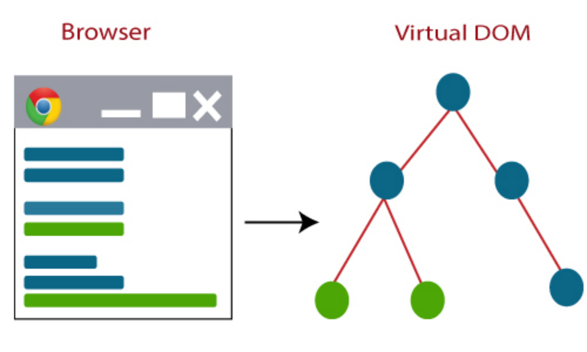
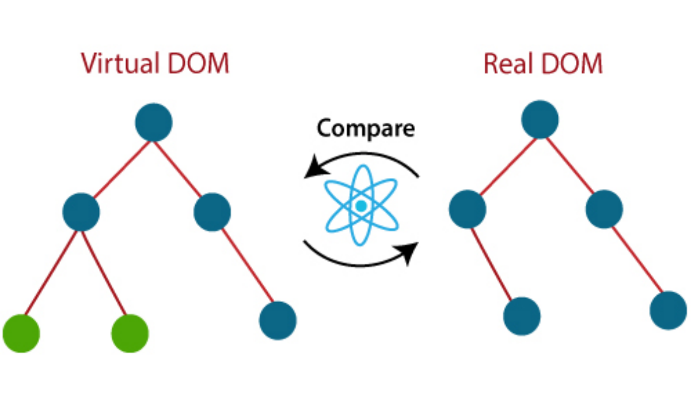
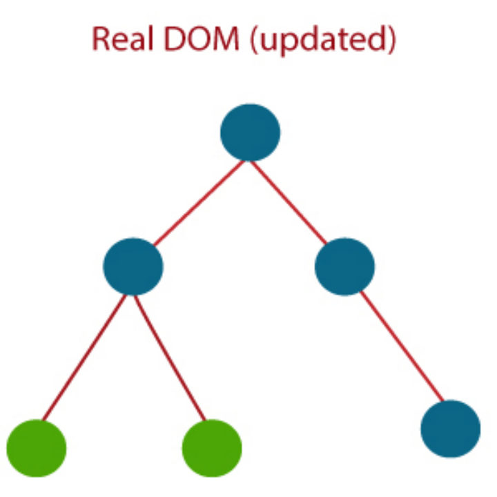

# 基础

## 1.特点

- JSX
- 组件
- 单向数据绑定
- 虚拟 DOM
- 简单
- 性能

> 缺点

- React有一个庞大的库，需要时间来理解。
- 新程序员可能很难理解和编码。
- React 使用内联模板和 JSX，这可能会很困难并充当障碍。它也使编码变得复杂。

## 2.JSX & TSX

### 2.1 JSX

```jsx
const element = <h1>Hello, world</h1>;
```

JSX 代表 JavaScript XML。

它是一个 React 扩展，允许编写看起来类似于 HTML 的 JavaScript 代码。

它使 HTML 文件易于理解。JSX 文件使 React 应用程序健壮并提高其性能。

JSX 允许在编写 JavaScript 代码的同一文件中编写类似 XML 的语法，然后预处理器(即，像 Babel 这样的转译器)将这些表达式转换为实际的 JavaScript 代码。就像 XML/HTML 一样，JSX 标签也有标签名称、属性和子标签。

> 特点

- 类XML语法容易接受，结构清晰
- 增强JS语义
- 抽象程度高，屏蔽DOM操作，跨平台
- 代码模块化

### 2.2 TSX

TSX 实际上就是 JSX 的 typescript 版本

## 3.生命周期

- 初始化阶段：
  - getDefaultProps:获取实例的默认属性
  - getInitialState:获取每个实例的初始化状态
  - componentWillMount：组件即将被装载、渲染到页面上
  - render:组件在这里生成虚拟的 DOM 节点
  - componentDidMount:组件真正在被装载之后

- 运行中状态：
  - componentWillReceiveProps:组件将要接收到属性的时候调用
  - shouldComponentUpdate:组件接受到新属性或者新状态的时候（可以返回 false，接收数据后不更新，阻止 render 调用，后面的函数不会被继续执行了）
  - componentWillUpdate:组件即将更新不能修改属性和状态
  - render:组件重新描绘
  - componentDidUpdate:组件已经更新
- 销毁阶段：
  - componentWillUnmount:组件即将销毁

生命周期指的是组件实例从创建到销毁的流程，函数组件没有生命周期，只有类组件才有，因为只有class组件会创建组件实例。
组件的生命周期可以分为挂载、更新、卸载阶段。
render是class组件中唯一必须实现的方法

> 挂载

- constructor 可以进行state和props的初始化
- static getDerivedStateFromProps
- render
- componentDidMount 第一次渲染后调用，可以访问DOM，进行异步请求和定时器、消息订阅

> 更新（当组件的props或state变化会触发更新）

- static getDerivedStateFromProps
- shouldComponentUpdate 返回一个布尔值，默认返回true，可以通过这个生命周期钩子进行性能优化，确认不需要更新组件时调用
- render
- getSnapShotBeforeUpdate
- componentDidUpdate 在组件完成更新后调用

> 卸载

- componentWillUnmount 组件从DOM中被移除的时候调用

> 错误捕获

- static getDerivedStateFromError 在errorBoundary中使用
- componentDidCatch

> `shouldComponentUpdate 是做什么的，（react 类组件性能优化是哪个周期函数？）`

shouldComponentUpdate 这个方法用来判断是否需要调用 render 方法重新描绘 dom。因为 dom 的描绘非常消耗性能，如果我们能在 shouldComponentUpdate 方法中能够写出更优化的 dom diff 算法，可以极大的提高性能。

## 4.三大属性 state & props & refs

1. state：来自组件内部的状态
2. props：来自外部的属性
3. refs：表示组件内的某一个元素

### 4.1 state

state 是一个对象，它包含组件的数据状态，当状态变化时，会触发视图的更新。你可以理解它的作用跟 Vue 中的 data 对象类似。

1、是组件的状态机，通过更新组件的state属性来刷新组件（对组件进行重新渲染）；

2、每个组件都有state，它的值是对象类型；

3、组件state属性的初始化放在构造方法中；

4、状态值的读取：this.state.xxx

5、状态值的更新：

```jsx
this.setState({ xxx: 值 })
```

6、根据组件有无state属性可以将组件分为：有状态组件和无状态组件。

有state属性的组件叫做有状态组件，没有state的组件是无状态组件

> setState

setState 修改状态是一种异步操作，使用的是对象式的使用方法，即第一个参数传入的是一个对象，此时它还可以传入第二个参数，是一个函数，该回调函数是在状态更新，且视图更新完成后调用，可以在这个函数中拿到最新的状态。

setState 还有函数式调用方法，即第一个参数传入一个函数，它的返回值是一个修改状态值的对象。该函数有两个参数，分别是当前组件的 state 和 props。此时 setState 也有一个回调函数，在状态更新，且视图更新完成后调用。

另外 setState 也不一定是同步或者异步的，是根据当前情况来决定的。立个flag，这个后面有时间再详细补充说明。

> 函数组件无法使用 state

函数组件内部因为没有 this，所以无法使用 state

### 4.2 props

1、每个组件都有props属性；

2、组件的属性值都保存在props中；

3、通过props可以在组件外部向组件内部传递参数；

4、在组件内部不能修改props属性的值（因为它是从外部传进去的，如果要修改就从传的地方进行修改）——props属性的只读属性

5、在组件内部读取某个属性的值：this.props.属性名

6、类组件的构造函数：

```jsx
constructor(props){
	super(props)
	console.log(props)   //输出组件的所有属性
}
```

7、设置props的默认值：

```jsx
组件名.defaultProps={
	属性名:值，
	属性名:值
}
```

8、属性值的类型和必要性限制：

（1）在组件外部定义时：

```jsx
组件名.propTypes={
	属性名:React.PropTypes.数据类型.必要性（isRequired）
}
```
（2）在组件内部定义时：

```jsx
static propTypes={
	属性名:PropTypes.数据类型.必要性（isRequired）
}
```

9、批量传递 props

```jsx
const data = { name: "abc", age: 12 };

<MyComponent {...data} />
```

### 4.3 refs

React 中的 Refs 可以让我们访问 DOM 节点，它有三种使用方式：

1. String 类型的 Refs

```jsx
class MyComponent extends React.Component {
  onInput = () => {
    const { myInput } = this.refs;
    console.log(myInput); // <input type="text">
    alert(myInput.value);
  };
  render() {
    return (
      <input ref="myInput" type="text" />
    )
  }
}
```

2. 回调 Refs

```jsx
class MyComponent extends React.Component {
  onInput = () => {
    console.log(this.myInput); // <input type="text">
    alert(this.myInput.value);
  };
  render() {
    return (
        <input ref={e => this.myInput = e} type="text" />
    );
  }
}
```

3. React.createRef()

```jsx
class MyComponent extends React.Component {
  // 创建 ref
  myInput = React.createRef();
  onInput = () => {
    console.log(this.myInput.current); // 这里需要注意，元素是在 current 属性上
    alert(this.myInput.current.value);
  };
  render() {
    return (
        <input ref={this.myInput} type="text" />
    );
  }
}
```

4. 函数组件使用useRef

```jsx

```

使用 React.createRef() 方法创建 ref 的方式，特别需要注意的是，创建出来的 ref 的值是一个对象，我们需要的 DOM 元素是放在对象的 current 属性上，如上面的 this.myInput.current

### 4.4 总结

> props和state的区别

（1）state：状态机，组件自身的可以变化的数据

（2）props：从组件外部向组件传递的数据，在组件内部对props只能读不能修改。在组件外部传值时修改。

## 5.虚拟dom

虚拟(Virtual)DOM是一个轻量级的 JavaScript 对象，它是真实 DOM 的内存表示。

它是调用渲染函数和在屏幕上显示元素之间的中间步骤。它类似于将元素、属性和内容作为对象及其属性列出的节点树。渲染函数创建 React 组件的节点树，然后更新此节点树以响应由用户或系统执行的各种操作导致的数据模型中的突变。

### 5.1 原理

虚拟(Virtual)DOM 分三个步骤工作：

第1步： 每当 React App 中的任何数据发生变化时，整个 UI 都会以 Virtual DOM 表示形式重新渲染。



第2步： 计算之前的 DOM 表示和新的 DOM 之间的差异。



第3步： 一旦计算完成，真实的 DOM 只更新那些被改变的东西。



### 5.2 真实 DOM 和虚拟 DOM 有什么区别？

下表指定了 Real DOM 和 Virtual DOM 之间的主要区别：

如果元素更新，真实的 DOM 会创建一个新的 DOM。

| 真实 DOM | 虚拟 DOM |
| -- | -- |
| 真正 DOM 更新较慢。	| 虚拟 DOM 更新更快。 |
|真正 DOM 可以直接更新 HTML。	|虚拟 DOM 不能直接更新 HTML。|
|如果元素更新	|虚拟 DOM 会更新 JSX。|
|在真实 DOM 中，DOM 操作非常昂贵。	|在虚拟 DOM 中，DOM 操作非常容易。|
|真实 DOM 中存在大量内存浪费。	|虚拟 DOM 中没有内存浪费。|

### 5.3 为什么虚拟 dom 会提高性能?

虚拟 dom 相当于在 js 和真实 dom 中间加了一个缓存，利用 dom diff 算法避免了没有必要的 dom 操作，从而提高性能。
用 JavaScript 对象结构表示 DOM 树的结构；然后用这个树构建一个真正的 DOM 树，插到文档当中当状态变更的时候，重新构造一棵新的对象树。然后用新的树和旧的树进行比较，记录两棵树差异把 2 所记录的差异应用到步骤 1 所构建的真正的 DOM 树上，视图就更新了。

### 5.4 react diff 原理

- 把树形结构按照层级分解，只比较同级元素。
- 给列表结构的每个单元添加唯一的 key 属性，方便比较。
- React 只会匹配相同 class 的 component（这里面的 class 指的是组件的名字）
- 合并操作，调用 component 的 setState 方法的时候, React 将其标记为 dirty.到每一个事件循环结束, React 检查所有标记 dirty 的 component 重新绘制.
- 选择性子树渲染。开发人员可以重写 shouldComponentUpdate 提高 diff 的性能。
