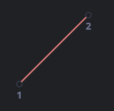

# CSS 动画 animation

- 位置 - 平移
- 方向 - 旋转
- 大小 - 缩放
- 透明度
- 其他 - 线形变换

## 前端动画怎么做

- transition 过渡动画
- animation 过渡动画
- JS 原生控制 DOM 位置
- canvas 绘制动画

### transition 过渡动画

CSS 过渡的理念非常简单，我们只需要定义某一个属性以及如何动态地表现其变化。当属性变化时，浏览器将会绘制出相应的过渡动画。

也就是说：我们只需要改变某个属性，然后所有流畅的动画都由浏览器生成。

参考[过渡动画](./transition.html)

CSS 提供了四个属性来描述一个过渡：

- transition-property
  - 规定设置过渡效果的 CSS 属性的名称。
- transition-duration
  - 规定完成过渡效果需要多少秒或毫秒。
- transition-timing-function
  - 规定速度效果的速度曲线。
- transition-delay
  - 定义过渡效果何时开始

```css
#color {
  transition: background-color 3s linear 0.1s, width 1s linear, height 1s linear;
}
#color:hover {
  background-color: #00ccff;
}
```

#### transition-timing-function

- ease 慢速开始，然后变快，然后慢速结束
- ease-in 慢速开始
- ease-out 慢结束
- ease-in-out
- linear 线性
- cubic-bezier(a,b,c,d)

bezier 曲线在线效果网址 <a href="http://cubic-bezier.com" target="_blank">cubic-bezier.com</a>

#### 贝塞尔曲线(cubic-bezier)

时间函数可以用[贝塞尔曲线](./cubic-bezier.md)描述，通过设置四个满足以下条件的控制点：

第一个应为：(0,0)。
最后一个应为：(1,1)。
对于中间值，x 必须位于 0..1 之间，y 可以为任意值。
CSS 中设置一贝塞尔曲线的语法为：cubic-bezier(x2, y2, x3, y3)。这里我们只需要设置第二个和第三个值，因为第一个点固定为 (0,0)，第四个点固定为 (1,1)。

时间函数描述了动画进行的快慢。

x 轴表示时间：0 —— 开始时刻，1 —— transition-duration的结束时刻。
y 轴表示过程的完成度：0 —— 属性的起始值，1 —— 属性的最终值。
最简单的一种情况就是动画匀速进行，可以通过设置曲线为 cubic-bezier(0, 0, 1, 1) 来实现。

看上去就像这样：



正如我们所见，这就是条直线。随着时间 x 推移，完成度 y 稳步从 0 增长到 1。

### keyframes 关键帧动画

相当于多个补间动画组合到一起

与 transition 不同的是，他可以让元素自己动，而不要求某值的改变来触发动画

`animation: name duration timing-function delay iteration-count direction;`

- animation-name
  - 规定需要绑定到选择器的 keyframe 名称。
- animation-duration
  - 规定完成动画所花费的时间，以秒或毫秒计
- animation-timing-function
  - 动画的速度曲线
- animation-delay
  - 动画开始之前的延迟
- animation-iteration-count
  - n | infinit
  - 动画应该播放的次数
- animation-direction
  - normal | alternate
  - 是否应该轮流反向播放动画
- animation-play-state
  - 可用于暂停动画
- animation-fill-mode
  - forwards 动画停了就保持最后的那个状态
  - backwards 动画停了还得反着做一遍回去
  - 在动画执行之前和之后如何给动画的目标应用样式。

参考[关键帧动画](./keyframes.html)

```html
<div class="progress"></div>

<style>
  @keyframes go-left-right {        /* 指定一个名字："go-left-right" */
    from { left: 0px; }             /* 从 left: 0px 开始 */
    to { left: calc(100% - 50px); } /* 移动至 left: 100%-50px */
  }

  .progress {
    animation: go-left-right 3s infinite alternate;
    /* 把动画 "go-left-right" 应用到元素上
       持续 3 秒
       持续次数：infinite
       每次都改变方向
    */

    position: relative;
    border: 2px solid green;
    width: 50px;
    height: 20px;
    background: lime;
  }
</style>
```

### 逐帧动画 frame by frame

关键帧之间是有补间的，会选一个效果过渡过去，而逐帧动画则是每个 keyframe 之间没有过渡，直接切换过去

参考[猎豹奔跑](./animal.html)

关键是使用下面这行 CSS

`animation-timing-function: steps(1);`

这个 step 是指定关键帧之间需要有几个画面

### 过渡动画和关键帧动画的区别

- 过渡动画需要有状态变化
- 关键帧动画不需要状态变化
- 关键帧动画能控制更精细

### CSS 动画的性能

- CSS 动画不差
- 部分情况下优于 JS
- JS 可以做到更精细
- 含高危属性，会让性能变差 (如 box-shadow)

### display 属性

当改变元素 display 属性时，过渡属性 transition 失效。

原因：
display:none 的时候，页面文档流中将不会存在该元素。transition 无法对一个从有到无的元素产生过渡效果。

解决方法：

1. 改变元素的宽/高为 0px,达到隐藏的目的。
2. 使用 visibility 替代 display。
3. react 使用 react-transition-group 实现
