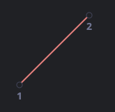

# CSS 动画

- 位置 - 平移
- 方向 - 旋转
- 大小 - 缩放
- 透明度
- 其他 - 线形变换

## 前端动画怎么做

- transition 过渡动画
- animation 过渡动画
- JS 原生控制 DOM 位置
- canvas 绘制动画

### transition 过渡动画

CSS 过渡的理念非常简单，我们只需要定义某一个属性以及如何动态地表现其变化。当属性变化时，浏览器将会绘制出相应的过渡动画。

也就是说：我们只需要改变某个属性，然后所有流畅的动画都由浏览器生成。

参考[过渡动画](./transition.html)

CSS 提供了四个属性来描述一个过渡：

- transition-property
  - 规定设置过渡效果的 CSS 属性的名称。
- transition-duration
  - 规定完成过渡效果需要多少秒或毫秒。
- transition-timing-function
  - 规定速度效果的速度曲线。
- transition-delay
  - 定义过渡效果何时开始

```css
#color {
  transition: background-color 3s linear 0.1s, width 1s linear, height 1s linear;
}
#color:hover {
  background-color: #00ccff;
}
```

#### transition-timing-function

- ease 慢速开始，然后变快，然后慢速结束
- ease-in 慢速开始
- ease-out 慢结束
- ease-in-out
- linear 线性
- cubic-bezier(a,b,c,d)

bezier 曲线在线效果网址 <a href="http://cubic-bezier.com" target="_blank">cubic-bezier.com</a>

#### 贝塞尔曲线(cubic-bezier)

时间函数可以用[贝塞尔曲线](./cubic-bezier.md)描述，通过设置四个满足以下条件的控制点：

第一个应为：(0,0)。
最后一个应为：(1,1)。
对于中间值，x 必须位于 0..1 之间，y 可以为任意值。
CSS 中设置一贝塞尔曲线的语法为：cubic-bezier(x2, y2, x3, y3)。这里我们只需要设置第二个和第三个值，因为第一个点固定为 (0,0)，第四个点固定为 (1,1)。

时间函数描述了动画进行的快慢。

x 轴表示时间：0 —— 开始时刻，1 —— transition-duration的结束时刻。
y 轴表示过程的完成度：0 —— 属性的起始值，1 —— 属性的最终值。
最简单的一种情况就是动画匀速进行，可以通过设置曲线为 cubic-bezier(0, 0, 1, 1) 来实现。

看上去就像这样：



正如我们所见，这就是条直线。随着时间 x 推移，完成度 y 稳步从 0 增长到 1。

### animation 关键帧动画 keyframes

相当于多个补间动画组合到一起

与 transition 不同的是，他可以让元素自己动，而不要求某值的改变来触发动画

`animation: name duration timing-function delay iteration-count direction;`

- animation-name
  - 规定需要绑定到选择器的 keyframe 名称。
- animation-duration
  - 规定完成动画所花费的时间，以秒或毫秒计
- animation-timing-function
  - 动画的速度曲线
- animation-delay
  - 动画开始之前的延迟
- animation-iteration-count
  - n | infinit
  - 动画应该播放的次数
- animation-direction
  - normal | alternate
  - 是否应该轮流反向播放动画
- animation-play-state
  - 可用于暂停动画
- animation-fill-mode
  - forwards 动画停了就保持最后的那个状态
  - backwards 动画停了还得反着做一遍回去
  - 在动画执行之前和之后如何给动画的目标应用样式。

```css
#one {
  width: 50px;
  height: 50px;
  background-color: orange;
  animation: run;
  animation-delay: 0.5s;
  animation-duration: 2s;
  animation-fill-mode: forwards;
}
@keyframes run {
  0% {
    width: 100px;
  }
  50% {
    width: 400px;
    background-color: blue;
  }
  100% {
    width: 800px;
  }
}
```
