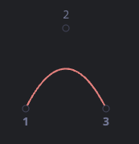
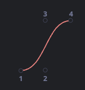
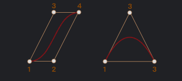

# 贝塞尔曲线(cubic-bezier)

贝塞尔曲线用于计算机图形绘制形状，CSS 动画和许多其他地方。

它们其实非常简单，值得学习一次并且在矢量图形和高级动画的世界里非常受用。

## 控制点

[贝塞尔曲线](https://en.wikipedia.org/wiki/B%C3%A9zier_curve)由控制点定义。

这些点可能有 2、3、4 或更多。

例如，两点曲线：

三点曲线：

四点曲线：

如果仔细观察这些曲线，你会立即注意到：

控制点不总是在曲线上这是非常正常的，稍后我们将看到曲线是如何构建的。

曲线的阶次等于控制点的数量减一。 对于两个点我们能得到一条线性曲线（直线），三个点 — 一条二阶曲线，四个点 — 一条三阶曲线。

曲线总是在控制点的凸包内部：

由于最后一个属性，在计算机图形学中，可以优化相交测试。如果凸包不相交，则曲线也不相交。因此，首先检查凸包的交叉点可以非常快地给出“无交叉”结果。检查交叉区域或凸包更容易，因为它们是矩形，三角形等（见上图），比曲线简单的多。

贝塞尔曲线绘制的主要重点 —— 通过移动曲线，曲线以直观明显的方式变化。

<!-- 尝试在下面的示例中使用鼠标移动控制点： -->

[其他](https://zh.javascript.info/bezier-curve)
