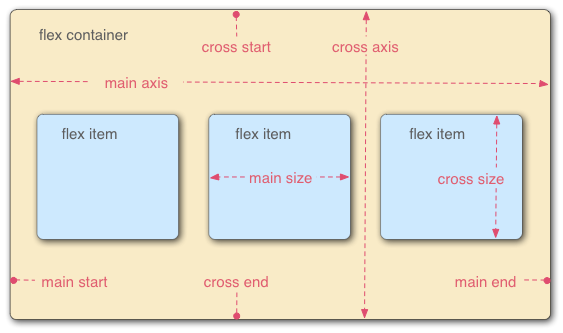
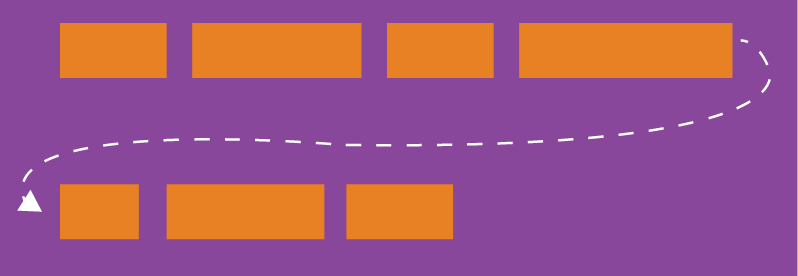

# flex布局

Flex是Flexible Box的缩写，意为”弹性布局”，用来为盒状模型提供最大的灵活性。



参考代码: [flex布局](./flex.html)

属性

- flex-direction
- flex-wrap
- flex-flow
- justify-content
- align-items
- align-content

## 1.flex-direction

参考代码: [flex-direction](./flex-direction.html)

flex-direction属性决定主轴的方向（即项目的排列方向）。

```css
.box {
  flex-direction: row | row-reverse | column | column-reverse;
}
```
flex-direction属性有4个值
- row（默认值）: 主轴为水平方向，起点在左端（项目从左往右排列）。
- row-reverse: 主轴为水平方向，起点在右端（项目从右往左排列）。
- column: 主轴为垂直方向，起点在上沿（项目从上往下排列）。
- column-reverse: 主轴为垂直方向，起点在下沿（项目从下往上排列）。

## 2.flex-wrap

参考代码: [flex-wrap](./flex-wrap.html)

默认情况下，项目都排在一条线（又称”轴线”）上。flex-wrap属性定义，如果一条轴线排不下，如何换行。



```css
.box{
  flex-wrap: nowrap | wrap | wrap-reverse;
}
```

属性
- nowrap（默认）: 不换行（列）。
- wrap: 主轴为横向时: 从上到下换行。主轴为纵向时: 从左到右换列。
- wrap-reverse: 主轴为横向时: 从下到上换行。主轴为纵向时: 从右到左换列。

## 3. flex-flow

flex-flow属性是flex-direction属性和flex-wrap属性的简写形式，默认值为row nowrap。

```css
.box {
  flex-flow: <flex-direction> <flex-wrap>;
}
```

## 4.justify-content

justify-content属性定义了项目在主轴上的对齐方式。

```css
.box {
  justify-content: flex-start | flex-end | center | space-between | space-around;
}
```

属性
- flex-start（默认）：与主轴的起点对齐。
- flex-end：与主轴的终点对齐。
- center：与主轴的中点对齐。
- space-between：两端对齐主轴的起点与终点，项目之间的间隔都相等。
- space-around：每个项目两侧的间隔相等。所以，项目之间的间隔比项目与边框的间隔大一倍。

## 5.align-items

align-items属性定义项目在交叉轴上如何对齐。纵向交叉轴始终自上而下，横向交叉轴始终自左而右。

```css
.box {
  align-items: flex-start | flex-end | center | baseline | stretch;
}
```

属性
- flex-start：交叉轴的起点对齐。
- flex-end：交叉轴的终点对齐。
- center：交叉轴的中点对齐。
- baseline: 项目的第一行文字的基线对齐。
- stretch（默认值）：如果项目未设置高度或设为auto，项目将占满整个容器的高度。

## 6 align-content

align-content属性定义了多根轴线的对齐方式。如果项目只有一根轴线，该属性不起作用。

```css
.box {
  align-content: flex-start | flex-end | center | space-between | space-around | stretch;
}
```

属性
- flex-start：与交叉轴的起点对齐。
- flex-end：与交叉轴的终点对齐。
- center：与交叉轴的中点对齐。
- space-between：与交叉轴两端对齐，轴线之间的间隔平均分布。
- space-around：每根轴线两侧的间隔都相等。所以，轴线之间的间隔比轴线与边框的间隔大一倍。
- stretch（默认值）：主轴线占满整个交叉轴。

## 7.项目的属性

设置在项目上的6个属性。

- order
- flex-grow
- flex-shrink
- flex-basis
- flex
- align-self

### 7.1.order
参考代码: [flex order](./flex-order.html)
order属性定义项目的排列顺序。数值越小，排列越靠前，默认为0。

```css
.item {
  order: <integer>;
}
```

### 7.2.flex-grow
参考代码: [flex-grow](./flex-grow.html)
flex-grow属性定义项目的放大比例，默认为0，即如果存在剩余空间，也不放大。

```css
.item {
  flex-grow: <number>; /* default 0 */
}
```

### 7.3.flex-shrink

参考代码: [flex-shrink](./flex-shrink.html)

flex-shrink属性定义了项目的收缩规则，默认为1，即如果空间不足，该项目将缩小。负值对该属性无效。如果flex-shrink值为0，表示该项目不收缩。

    当子元素宽度和大于父元素宽度时，flex-shrink 将会按照一定的比例进行收缩，即将子元素宽度之和与父元素宽度的差值按照子元素flex-shrink值来分配给各个子元素，指定各个子元素收缩多少，每个子元素原本宽度减去按比例分配的值，其剩余值为收缩完的实际宽度。

```css
.item {
  flex-shrink: <number>; /* default 1 */
}
```

flex-shrink之和大于或等于1

主轴长度为1000px，子元素溢出空间：(300 + 400 + 500) - 1000 = 200 px。

flex-shrink小于1

当所有项目的flex-shrink之和小于1，只收缩溢出空间的一部分。