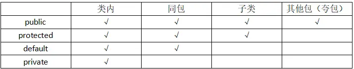

## 1.字面量,标识符,关键字

字面量: 计算机用来处理数据的, 即`数据在程序中的书写格式`

标识符: 名字

关键字: java中有特殊含义的词

## 2.变量

变量: 记住程序要处理的数据, 即`计算机内存中的一块数据`

### 2.1 变量定义格式

>数据类型 变量名称 = 数据

### 2.2 存储原理

字节: 计算机存储的最小单元 (B byte)

位: 字节中的每个二进制位(b bit)

1B = 8b

### 2.3 变量类型

1. 局部变量
2. 成员变量
    1. 静态成员变量
    2. 实例成员变量

## 3.修饰符

用来限制类中的成员,能够被访问的范围

- default (即默认，什么也不写）: 在同一包内可见，不使用任何修饰符。使用对象：类、接口、变量、方法。
- private : 在同一类内可见。使用对象：变量、方法。 注意：不能修饰类（外部类）
- public : 对所有类可见。使用对象：类、接口、变量、方法
- protected : 对同一包内的类和所有子类可见。使用对象：变量、方法。 注意：不能修饰类（外部类）。

