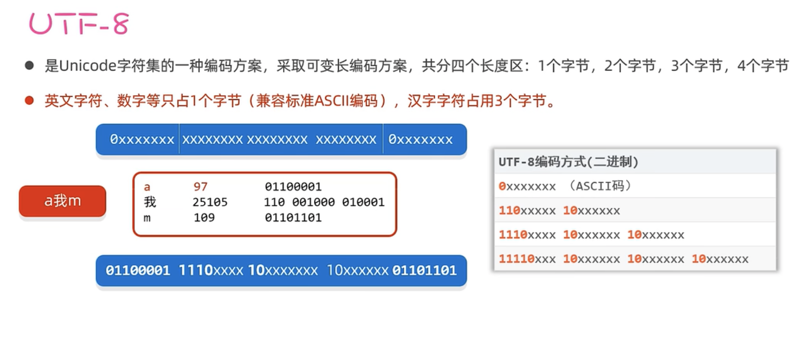

# IO 流 FIle

## 1.File(代表文件)

File 是 java.io 下的一个类, File 类的对象, 用于代表当前操作系统的文件(可以是`文件或文件夹`)

File 只能对文件本身进行操作,`不能对文件读写文件内存储的数据`

## 2.字符

ASCLL: 只有英文数字字符,占 1 个字节

GBK: 汉字占 2 个字节 英文,数字占 1 个字节

UTF-8: 汉字占 3 个字节,英文,数字占 1 个字节

1. utf-8



## 3.IO 流(读写数据)(输入输出流)

Input Output

用于读写数据(文件数据或者网络数据)

> 最小单位: 字节流 字符流

### 3.1 字节流

1. InputStream(FileInputStream)

读取一个或多个字节,但是中文会乱码(read)

读取文件的全部字节(readAllBytes)

2. OutputStream(FileOutputStream)

写入一个或多个字节

### 3.2 字符流

1. Reader(FileReader)

读取一个或多个字符,中文不会乱码(read)

读取文件的全部字节(readAllBytes)

2. Writer(FileWriter)

写入一个或多个字符

### 3.3 应用场景

1. 字节流适合做一切文件数据的拷贝(音视频,文本), 不适合读取中文输出的内容
2. 字符流适合做文本文件的操作(读,写等)

## 4.释放资源的方式

1. try-catch-finally
2. try-with-resource

> 资源对象: 资源都是会实现 `AutoCloseable` 接口,都会有 1 个 close 方法,用完后,自动调用 close 方法释放资源

```
try(定义资源对象1,资源2...) {
  代码...
} catch(异常类名 变量名) {
  异常处理代码
}
```

```java
public static void main(String[] args) {
    Try1();
    Try2();
}
// 1. try-catch-finally 臃肿
static void Try1() {
    InputStream is = null;
    OutputStream os = null;
    try {
        is = new FileInputStream(filepath2in);
        byte[] buffer = is.readAllBytes();
        os = new FileOutputStream(filepath2out);
        os.write(buffer);
    } catch (Exception e) {
        e.printStackTrace();
    } finally {
        try {
            if (is != null) is.close();
        } catch (IOException e) {
            e.printStackTrace();
        }
        try {
            if (os != null) os.close();
        } catch (IOException e) {
            e.printStackTrace();
        }
    }
}

// 2. try-with-resource ok 自动执行关闭方法 (is, os).close()
static void Try2() {
    try (
        InputStream is = new FileInputStream(filepath2in);
        OutputStream os = new FileOutputStream(filepath2out);
    ) {
        byte[] buffer = is.readAllBytes();
        os.write(buffer);
    } catch (Exception e) {
        e.printStackTrace();
    }
}
```

## 5.缓冲流

Buffered~

对原始流进行包装,以提升原始流读写数据的性能

### 5.1 字节缓冲流

字节缓冲输入流,字节缓冲输出流各自带`8KB的缓冲池`

1. BufferedInputStream

2. BufferedOutputStream

```java
static String filepath2in = "se_base/src/com/gdj/io/io/4.txt";
static String filepath2out = "se_base/src/com/gdj/io/io/4_copy_buffered1.txt";

public static void main(String[] args) {
    Try2();
}

static void Try2() {
    try (
            InputStream is = new FileInputStream(filepath2in);
            InputStream bis = new BufferedInputStream(is, 8192 * 2); // 默认8192
            OutputStream os = new FileOutputStream(filepath2out);
            OutputStream bos = new BufferedOutputStream(os);
    ) {
        byte[] buffer = new byte[1024];
        int len;
        while ((len = bis.read(buffer)) != -1) {
            bos.write(buffer, 0, len);
        }
        System.out.println("over");
    } catch (Exception e) {
        e.printStackTrace();
    }
}
```

### 5.2 字符缓冲流

字符缓冲输入流,字符缓冲输出流各自带`8KB的缓冲池`

1. BufferedReader

2. BufferedWriter

### 5.3 性能分析

```java
/**
 * 性能比较
 * <p>
 * ① 使用低级的字节流按照一个一个字节的形式复制文件。
 * ② 使用低级的字节流按照字节数组的形式复制文件。
 * ③ 使用高级的缓冲字节流按照一个一个字节的形式复制文件。
 * ④ 使用高级的缓冲字节流按照字节数组的形式复制文件。
 */
public class IOPerformance {
    static String filepath2in = "se_base/src/com/gdj/io/io/test.dmg"; // 248M文件
    static String filepath2out1 = "se_base/src/com/gdj/io/io/test1.dmg";
    static String filepath2out2 = "se_base/src/com/gdj/io/io/test2.dmg";
    static String filepath2out3 = "se_base/src/com/gdj/io/io/test3.dmg";
    static String filepath2out4 = "se_base/src/com/gdj/io/io/test4.dmg";

    public static void main(String[] args) {
//        test1(); // 淘汰
        test2(); // 993毫秒
//        test3(); // 淘汰
        test4(); // 843毫秒
    }
    static void test1() {
        long time1 = System.currentTimeMillis();
        try (
                InputStream is = new FileInputStream(filepath2in);
                OutputStream os = new FileOutputStream(filepath2out1);
        ) {
            int len;
            while ((len = is.read()) != -1) {
                os.write(len);
            }
        } catch (Exception e) {
            e.printStackTrace();
        } finally {
            long time2 = System.currentTimeMillis();
            System.out.println(time2 - time1);
        }
    }

    static void test2() {
        long time1 = System.currentTimeMillis();
        try (
                InputStream is = new FileInputStream(filepath2in);
                OutputStream os = new FileOutputStream(filepath2out2);
        ) {
            byte[] buffer = new byte[1024 * 8];
            int len;
            while ((len = is.read(buffer)) != -1) {
                os.write(buffer, 0, len);
            }
        } catch (Exception e) {
            e.printStackTrace();
        } finally {
            long time2 = System.currentTimeMillis();
            System.out.println(time2 - time1);
        }
    }

    static void test3() {
        long time1 = System.currentTimeMillis();
        try (
                InputStream is = new FileInputStream(filepath2in);
                BufferedInputStream bis = new BufferedInputStream(is);
                OutputStream os = new FileOutputStream(filepath2out3);
                BufferedOutputStream bos = new BufferedOutputStream(os);
        ) {
            int len;
            while ((len = bis.read()) != -1) {
                bos.write(len);
            }
        } catch (Exception e) {
            e.printStackTrace();
        } finally {
            long time2 = System.currentTimeMillis();
            System.out.println(time2 - time1);
        }
    }

    static void test4() {
        long time1 = System.currentTimeMillis();
        try (
                InputStream is = new FileInputStream(filepath2in);
                BufferedInputStream bis = new BufferedInputStream(is);
                OutputStream os = new FileOutputStream(filepath2out4);
                BufferedOutputStream bos = new BufferedOutputStream(os);
        ) {
            byte[] buffer = new byte[1024 * 8];
            int len;
            while ((len = bis.read(buffer)) != -1) {
                bos.write(buffer, 0, len);
            }
        } catch (Exception e) {
            e.printStackTrace();
        } finally {
            long time2 = System.currentTimeMillis();
            System.out.println(time2 - time1);
        }
    }
}
```

## 6.转换流

解决不同编码问题时,字符流读取写入文本时内容乱码问题

### 6.1 字符输入转换流

InputStreamReader

### 6.2 字符输出转换流

OutputStreamReader

```java
void testOutput() {
    try (
            InputStream is = new FileInputStream(filepath2in);
            Reader isr = new InputStreamReader(is, "GBK");
            BufferedReader br = new BufferedReader(isr);
            OutputStream os = new FileOutputStream(filepath2out);
            Writer isw = new OutputStreamWriter(os, "GBK");
    ) {
        char[] buffer = new char[1024];
        int line;
        while ((line = br.read(buffer)) != -1) {
            isw.write(buffer, 0, line);
        }
    } catch (Exception e) {
        e.printStackTrace();
    }
}
```

## 7.打印流

PrintStream/PrintWriter

实现更高效更方便的打印数据,打印什么就是什么,不支持追加

```java
void test1() {
    try (
            PrintStream ps = new PrintStream(filepath2out, "GBK");
    ) {
        ps.println(111);
        ps.println(1.1);
        ps.println("ow是啥叫");
        ps.println('a');
        ps.println(true);
        ps.write(97);
    } catch (Exception e) {
        e.printStackTrace();
    }
}
void test2() {
    try (
            PrintWriter ps = new PrintWriter(filepath2out2, "GBK");
    ) {
        ps.println(111222);
        ps.println(1.12);
        ps.println("ow是啥叫");
        ps.println('d');
        ps.println(true);
        ps.write(97);
    } catch (Exception e) {
        e.printStackTrace();
    }
}
// 追加
void test3() {
    try (
            PrintWriter ps = new PrintWriter(new FileOutputStream(filepath2out3, true));
    ) {
        ps.println(111222);
        ps.println(1.12);
        ps.println("ow是啥叫");
        ps.println('d');
        ps.println(true);
        ps.write(97);
    } catch (Exception e) {
        e.printStackTrace();
    }
}
void test4() {
  // 控制台输出
    System.out.println(1111);
    System.out.println(2222);
    try (
            PrintStream ps = new PrintStream(filepath2out4);
    ) {
        System.setOut(ps);
        // 文件输出
        System.out.println(3333);
        System.out.println(4444);
    } catch (Exception e) {
        e.printStackTrace();
    }
}
```

### 7.1 应用场景

> 输出语句的重定向: 可以把输出语句的打印位置改到某个文件中

```java
PrintStream ps = new PrintStream(filepath2out4);
System.setOut(ps);
```

## 8.数据流

DataInputStream/DataOutputStream

## 9.序列化流

ObjectInputStream/ObjectOutputStream

把 java 对象进行序列化,将 java 对象存入文件或读取文件

对象如果需要序列化,必须实现序列化接口

ArrayList 也实现了序列化接口

## 10.IO 框架

1. commons-io

### 10.1 导入框架

1. 项目下创建 lib 文件夹
2. 将 jar 包放入 lib 下
3. 在 jar 包上面右键, `Add as Library`, 确定
4. 使用 jar 包
