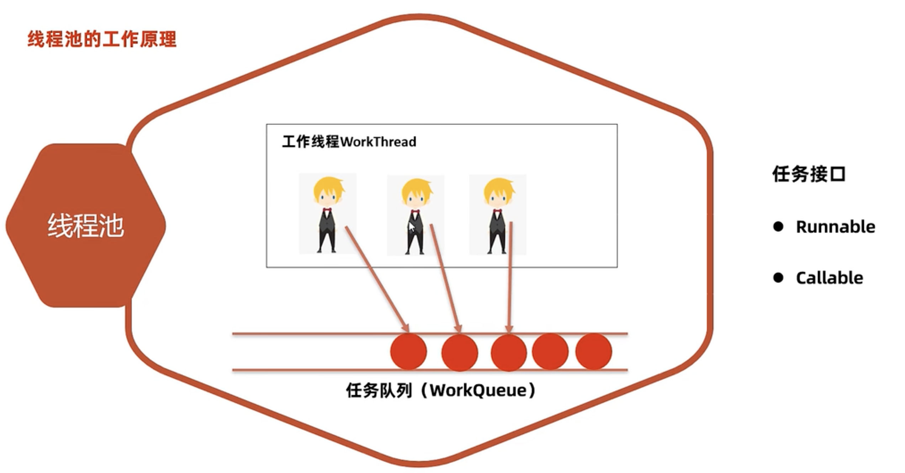
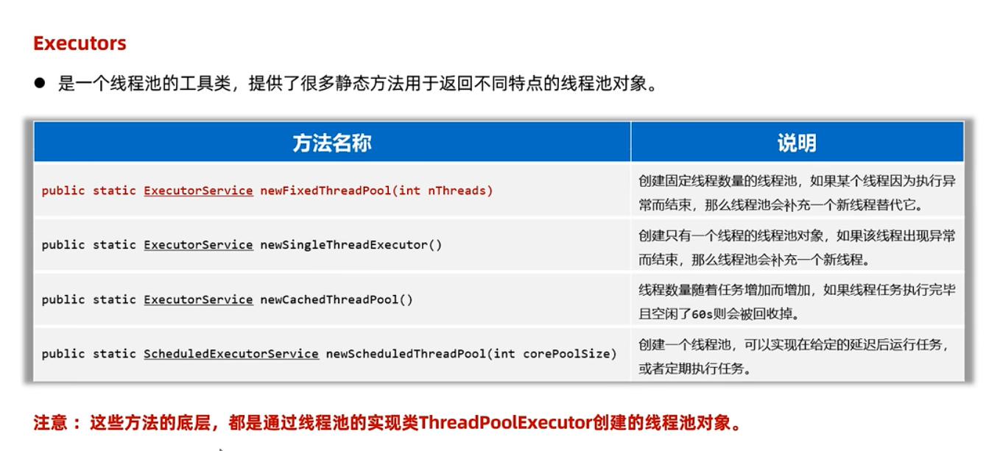
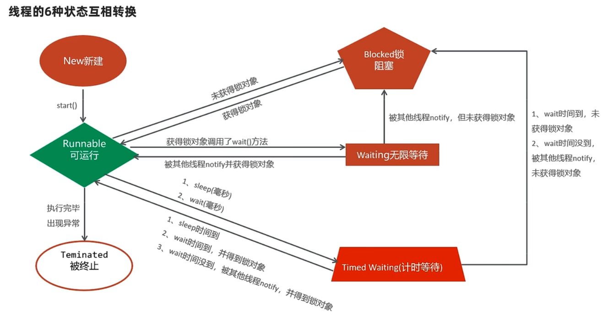

# 多线程

> 进程

1. 正在运行的程序(软件)就是一个独立的进程
2. 线程属于进程, 一个进程可以有多个线程
3. 进程中的多个线程是并发和并行执行的

## 1. 线程(Thread)

线程是程序内部的一条执行流程

## 2. 多线程

软硬件上实现的多条执行流程的技术(多条线程是由 CPU 负责执行调度的)

### 2.1 多线程创建方式

#### 2.1.1 继承 Thread 类

1. 创建类 MyThread 继承 Thread
2. 重写 run 方法
3. 创建 MyThread 对象 mt
4. 执行 mt.start 方法启动线程(执行 run 方法)

> 注意

1. 启动线程必须调用 start 方法,不是 run 方法 (run 方法还是走了单线程)
2. 不要把主线程放在启动子线程之前

```java
public class MyThread extends Thread {
    @Override
    public void run() {
        for (int i = 0; i < 5; i++) {
            System.out.println("MyThread输出i: " + i);
        }
    }
}
public class Test {
    public static void main(String[] args) {
        ThreadTest();
    }
    static void ThreadTest(){
        Thread  t = new MyThread();
        t.start();
        for (int i = 0; i < 5; i++) {
            System.out.println("ThreadTest 输出i: " + i);
        }
    }
}
```

#### 2.1.2 实现 Runnable 接口

1. 创建类 MyRunnable 实现 Runnable
2. 重写 run 方法
3. 创建 MyRunnable 对象 mr
4. 将对象 mr 交给线程 Thread 处理(执行 new Thread(mr).start() 方法启动线程)

> 优点: 任务类是实现接口,可以继承其他类,实现其他接口,扩展性强

```java
public class MyRunnable implements Runnable {
    @Override
    public void run() {
        for (int i = 0; i < 5; i++) {
            System.out.println("MyRunnable 输出i: " + i);
        }
    }
}
public class Test {
    public static void main(String[] args) {
        RunnableTest();
        RunnableTest2();
    }
    static void RunnableTest(){
        Runnable  t = new MyRunnable();
        new Thread(t).start();
        for (int i = 0; i < 5; i++) {
            System.out.println("RunnableTest 输出i: " + i);
        }
    }
    static void RunnableTest2() {
        new Thread(new Runnable() {
            @Override
            public void run() {
                for (int i = 0; i < 5; i++) {
                    System.out.println("RunnableTest2 Thread1 输出i: " + i);
                }
            }
        }).start();
        new Thread(() -> {
            for (int i = 0; i < 5; i++) {
                System.out.println("RunnableTest2 Thread2 输出i: " + i);
            }
        }).start();
        for (int i = 0; i < 5; i++) {
            System.out.println("RunnableTest2 main 输出i: " + i);
        }
    }
}
```

#### 2.1.3 实现 Callable 接口

1. 创建类 MyCallable 实现 Callable
2. 重写 call 方法, 封装要做的事和要返回的数据
3. 创建 MyCallable 对象 mc
4. 将对象 mc 封装成 FutureTask 对象 ft(线程任务对象)
5. 把 ft 交给 Thread 执行 start 方法启动线程
6. 执行完毕后,通过 ft.get() 方法获取返回结果

> 优点: 任务类是实现接口,可以继承其他类,实现其他接口,扩展性强. `可以在线程执行完毕后获取执行结果`

```java
public class MyCallable implements Callable<String> {
    int n;
    public MyCallable(int n) {
        this.n = n;
    }
    @Override
    public String call() throws Exception {
        int sum = 0;
        for (int i = 0; i < n; i++) {
            sum += i;
        }
        return "1-" + n + "和为: " + sum;
    }
}

public class Test {
    public static void main(String[] args) throws Exception {
        CallableTest();
    }
    static void CallableTest() throws Exception {
        Callable<String> c = new MyCallable(100);
        FutureTask ft  = new FutureTask(c);
        new Thread(ft).start();
        System.out.println(ft.get());

        FutureTask ft2 = new FutureTask<Integer>(() -> 1);
        new Thread(ft2).start();
        System.out.println(ft2.get());
    }
}
// 1-100和为: 4950
// 1
```

## 3.线程安全

多个线程,同时操作同一个共享资源时,可能会出现业务安全问题

```java
/**
 * 张三李四拥有1个账户 金额100000元
 * 同时取100000元会出bug
 */
public class App {
    public static void main(String[] args) {
        Account acc = new Account("CardId1", 100000);
        new SafeThread(acc, "张三").start();
        new SafeThread(acc, "李四").start();
    }
}
public class Account {
    private String cardId;
    private double money;
    public Account(String cardId, double money) {
        this.cardId = cardId;
        this.money = money;
    }
    public void drawMoney(double money) {
        String name = Thread.currentThread().getName();
        if (this.money >= money) {
            System.out.println("余额:" + this.money);
            this.money -= money;
            System.out.println(name + "取了" + money + "还剩余" + this.money);
        } else {
            System.out.println(name + "余额不足!, 当前余额为" + this.money);
        }
    }
}
public class SafeThread extends Thread {
    Account acc;
    public SafeThread(Account acc, String name) {
        this.acc = acc;
        this.setName(name);
    }
    @Override
    public void run() {
        acc.drawMoney(100000);
    }
}
// 控制台输出:
// 李四,余额:100000.0
// 张三,余额:100000.0
// 张三取了100000.0还剩余-100000.0
// 李四取了100000.0还剩余0.0
```

## 4.线程同步

解决线程安全问题的方案

让多一个线程实现先后依次访问共享资源,这样就解决了线程安全问题

### 4.1 常见方案

### 4.1.1 同步代码块

每次只允许一个线程加锁,加锁后才能进入访问,访问完毕后自动解锁,然后其他线程才能在加锁进来

```java
synchronized (同步依赖) {
    访问共享资源的核心代码
}
```

> 作用: 把访问共享资源的核心代码给上锁,以此保证线程安全

> 原理: 每次只允许一个线程加锁进入,执行完毕后自动解锁,其他线程才能在加锁进来执行

> 同步锁的注意事项

1. 对于当前同时执行的线程来说,同步锁必须是同一把(同一个对象),否则会有 bug

```java
public void drawMoney(double money) {
    String name = Thread.currentThread().getName();
    // 将核心代码加锁 this代表当前账户
    synchronized (this) {
        if (this.money >= money) {
            System.out.println(name + ",余额:" + this.money);
            this.money -= money;
            System.out.println(name + "取了" + money + "还剩余" + this.money);
        } else {
            System.out.println(name + "余额不足!, 当前余额为" + this.money);
        }
    }
}
// 控制台输出:
// 张三,余额:100000.0
// 张三取了100000.0还剩余0.0
// 李四余额不足!, 当前余额为0.0

// 如果是静态方法, 使用`类名.class`替代`this`
public static void test() {
    synchronized (Account.class) {
        // ...
    }
}
```

### 4.1.2 同步方法

> 作用: 把访问共享资源的核心方法给上锁,以此保证线程安全

> 原理: 每次只允许一个线程加锁进入,执行完毕后自动解锁,其他线程才能在加锁进来执行

> 底层原理

1. 底层也是有隐式锁对象的,只是锁的范围是整个方法
2. 如果是实例方法,同步方法默认用 this 作为锁对象
3. 如果是静态方法,同步方法默认用`类名.class`作为锁对象

```java
修饰符 synchronized 返回值类型 方法名(形参列表) {
    操作共享资源的代码
}
```

```java
public synchronized void drawMoney(double money) {
    String name = Thread.currentThread().getName();
    if (this.money >= money) {
        System.out.println(name + ",余额:" + this.money);
        this.money -= money;
        System.out.println(name + "取了" + money + "还剩余" + this.money);
    } else {
        System.out.println(name + "余额不足!, 当前余额为" + this.money);
    }
}
```

> **同步代码块和同步方法哪个好一点?**

1. 范围上: 同步代码块锁的范围更小,同步方法锁的范围更大. 范围越小性能越好(差别微乎其微)
2. 可读性: 同步方法更好

### 4.1.3 Lock 锁

Lock 锁是 jdk5 开始提供的一个新的锁定操作,可以创建出锁对象进行加锁和解锁

Lock 是接口,不能直接实例化,可以用它的实现类 ReentrantLock 来构建 Lock 锁对象

```java
public class Account {
    private String cardId;
    private double money;
    private final Lock lock = new ReentrantLock();
    public void drawMoney(double money) {
        String name = Thread.currentThread().getName();
        lock.lock(); // 加锁
        try {
            if (this.money >= money) {
                System.out.println(name + ",余额:" + this.money);
                this.money -= money;
                System.out.println(name + "取了" + money + "还剩余" + this.money);
            } else {
                System.out.println(name + "余额不足!, 当前余额为" + this.money);
            }
        } catch (Exception e) {
            e.printStackTrace();
        } finally {
            lock.unlock(); // 解锁
        }
    }
}
```

## 5.线程通信

当多个线程共同操作共享的资源时,线程通过某种方式互相告知自己的状态,以相互协调,并避免无效的资源争夺

> **常见类型(生产者与消费者模型)**

1. 生产者线程负责生产数据
2. 消费者线程负责消费生产者产生的数据

> 注意: 生产者生产完数据应该等待自己,通知消费者消费;消费者消费完数据也应该等待自己,再通知生产者生产

例子:
3 个生产者线程,负责生产包子,每个线程每次只能生产 1 只包子放在桌子上;
2 个消费者线程负责吃包子,每人每次只能从桌子上拿 1 个包子

```java
public class Test {
    public static void main(String[] args) {
        Desk d = new Desk();
        new Thread(() -> {
            while (true) {
                d.put();
            }
        }, "厨师1").start();
        new Thread(() -> {
            while (true) {
                d.put();
            }
        }, "厨师2").start();
        new Thread(() -> {
            while (true) {
                d.put();
            }
        }, "厨师3").start();

        new Thread(() -> {
            while (true) {
                d.eat();
            }
        }, "吃货1").start();
        new Thread(() -> {
            while (true) {
                d.eat();
            }
        }, "吃货1").start();
    }
}
public class Desk {
    private List<String> list = new ArrayList<>();
    // 放包子
    public synchronized void put() {
        try {
            String name = Thread.currentThread().getName();
            if (list.size() == 0) {
                list.add(name + "的包子");
                System.out.println(name + "做了一个包子");
                Thread.sleep(2000);
            }
            // 等待自己,唤醒别人
            this.notifyAll();
            this.wait();
        } catch (Exception e) {
            e.printStackTrace();
        }
    }
    // 吃包子
    public synchronized void eat() {
        try {
            String name = Thread.currentThread().getName();
            if(list.size() > 0) {
                System.out.println(name + "吃了" + list.get(0));
                list.remove(0);
                Thread.sleep(1000);
            }
            this.notifyAll();
            this.wait();
        } catch (Exception e) {
            e.printStackTrace();
        }
    }
}
// 厨师1做了一个包子
// 吃货1吃了厨师1的包子
// 厨师3做了一个包子
// 吃货1吃了厨师3的包子
// 厨师1做了一个包子
// 吃货1吃了厨师1的包子
// 厨师3做了一个包子
// 吃货1吃了厨师3的包子
// 厨师1做了一个包子
// 吃货1吃了厨师1的包子
// 厨师2做了一个包子
// ...
```

## 6.线程池

接口 ExecutorService

复用线程的技术

> 如果不使用线程池

用户每发起一个请求,后台就需要创建一个线程来处理,下次新任务来了又要创建新的线程,`创建线程的开销是很大的,并且请求过多时,肯定会产生大量的线程`,会严重影响系统性能

工作原理



> 线程池对象

1. 使用 ExecutorService 的实现类 ThreadPoolExecutor 创建一个线程池对象
2. 使用 Executors(线程池工具类)调用方法返回不同特点的线程池对象

> 核心线程池数量?

1. 计算密集型任务: 数量= CPU 核数 \+ 1;
1. IO 密集型任务: 数量= CPU 核数 \* 2;

### 6.1 ThreadPoolExecutor 构造器

```java
    public ThreadPoolExecutor(
        int corePoolSize,
        int maximumPoolSize,
        long keepAliveTime,
        TimeUnit unit,
        BlockingQueue<Runnable> workQueue,
        ThreadFactory threadFactory,
        RejectedExecutionHandler handler) {
    this(corePoolSize, maximumPoolSize, keepAliveTime, unit, workQueue, Executors.defaultThreadFactory(), defaultHandler);
}

ExecutorService pool = new ThreadPoolExecutor(3, 5, 8,
    TimeUnit.SECONDS, new ArrayBlockingQueue<>(4), Executors.defaultThreadFactory(),
    new ThreadPoolExecutor.AbortPolicy()
);
```

1. 参数一：corePoolSize ：指定线程池的核心线程的数量。
2. 参数二：maximumPoolSize：指定线程池的最大线程数量。
3. 参数三：keepAliveTime：指定临时线程的存活时间。
4. 参数四：unit：指定临时线程存活的时间单位（秒、分、时、天）
5. 参数五：workQueue：指定线程池的任务队列。
6. 参数六：threadFactory：指定线程池的线程工厂。
7. 参数七：handler：指定线程池的任务拒绝策略（线程都在忙，任务队列也满了的时候，新任务来了该怎么处理）

> 任务拒绝策略

1. ThreadPoolExecutor.AbortPolicy 丢弃任务,并抛出异常 RejectedExecutionException(默认策略)
2. ThreadPoolExecutor.DiscardPolicy 丢弃任务,但不抛出异常 不推荐
3. ThreadPoolExecutor.DiscardOldestPolicy 抛弃队列中等待最久的任务,然后把当前任务加入队列中
4. ThreadPoolExecutor.CallerRunsPolicy 由主线程负责调用任务的 run 方法,从而绕过线程池直接执行

> 注意

1. 临时线程什么时候创建?

新任务提交时发现核心线程都在忙,任务队列也满了,并且还可以创建临时线程,此时才会创建临时线程

2. 什么时候开始拒绝新任务?

核心线程和临时线程都在忙,任务队列也满了,新的任务过来时才会开始拒绝任务

### 6.2 线程池处理 Runnable 任务

```java
public class Test {
    public static void main(String[] args) throws Exception {
//        testRunnable();
        testCallable();
    }
    static void testRunnable() {
        ExecutorService pool = new ThreadPoolExecutor(3, 5, 8,
                TimeUnit.SECONDS, new ArrayBlockingQueue<>(4), Executors.defaultThreadFactory(),
                new ThreadPoolExecutor.AbortPolicy()
        );

        Runnable r = new MyRunnable();
        pool.execute(r);
        pool.execute(r);
        pool.execute(r);

        // 复用前面的核心线程
        pool.execute(r);
        pool.execute(r);
        pool.execute(r);
        pool.execute(r);

        // 临时线程
        pool.execute(r);
        pool.execute(r);

        // 到了新任务的拒绝时机了 抛出了异常 RejectedExecutionException
        pool.execute(r);

        pool.shutdown(); // 线程池执行完毕后关闭
//        pool.shutdownNow(); // 立即关闭
    }
}

public class MyRunnable implements Runnable {
    @Override
    public void run() {
        try {
            System.out.println(Thread.currentThread().getName()+" 执行中...");
            Thread.sleep(3000);
        } catch (Exception e) {
            e.printStackTrace();
        }
    }
}
// 控制台输出: 前5个包含了3个核心线程和2个临时线程
// RejectedExecutionException...异常描述
// pool-1-thread-4 执行中...
// pool-1-thread-1 执行中...
// pool-1-thread-2 执行中...
// pool-1-thread-5 执行中...
// pool-1-thread-3 执行中...

// pool-1-thread-4 执行中...
// pool-1-thread-2 执行中...
// pool-1-thread-3 执行中...
// pool-1-thread-5 执行中...
```

### 6.3 线程池处理 Callable 任务

```java
public class Test {
    public static void main(String[] args) throws Exception {
        testCallable();
    }

    static void testCallable() throws Exception {
        ExecutorService pool = new ThreadPoolExecutor(3, 5, 8,
                TimeUnit.SECONDS, new ArrayBlockingQueue<>(4), Executors.defaultThreadFactory(),
                new ThreadPoolExecutor.AbortPolicy()
        );

        Future f1 = pool.submit(new MyCallable(100));
        Future f2 = pool.submit(new MyCallable(200));
        Future f3 = pool.submit(new MyCallable(300));
        Future f4 = pool.submit(new MyCallable(400));

        System.out.println(f1.get());
        System.out.println(f2.get());
        System.out.println(f3.get());
        System.out.println(f4.get());

        pool.shutdown();
    }
}
public class MyCallable implements Callable<String> {
    private int n;
    public MyCallable(int n) {
        this.n = n;
    }
    @Override
    public String call() throws Exception {
        int sum = 0;
        for (int i = 0; i < n; i++) {
            sum += i;
        }
        return "和为: "+ sum;
    }
}
// 控制台输出:
// 和为: 4950
// 和为: 19900
// 和为: 44850
// 和为: 79800
```

### 6.4 Executors 工具类处理线程池



```java
ExecutorService pool = Executors.newFixedThreadPool(3);
// ...
```

> 注意: 大型并发系统环境中使用 Executors 如果不注意可能会存在系统风险

### 6.5 并发,并行

> 并发

进程中的线程是由 CPU 负责调度执行的，但 CPU 能同时处理线程的数量有限，为了保证全部线程都能往前执行，
CPU 会轮询为系统的每个线程服务，由于 CPU 切换的速度很快，给我们的感觉这些线程在同时执行，这就是并发。

> 并行

同一时刻上,同时有多个线程在被 CPU 调度执行

> 多线程怎么执行的?

并发和并行同时进行的

### 6.6 线程的生命周期

> 6 种

1. NEW
2. RUNNABLE
3. BLOCKED
4. WAITING
5. TIMED_WAITING
6. TERMINATED



## 7.其他锁

### 7.1 悲观锁

一开始就加锁,没有安全感,每次只能一个线程进入访问完毕后,再解锁,线程安全,性能较差

```java
public class App {
    public static void main(String[] args) {
        test1();
    }
    private static void test1() {
        // 悲观锁
        // 需求: 1个静态变量,100个线程,每个线程对其加100次
        Runnable r = new MyRunnable();
        for (int i = 1; i <= 100; i++) {
            new Thread(r).start();
        }
    }
}
public class MyRunnable implements Runnable {
    private int count;
    @Override
    public void run() {
        final String name = Thread.currentThread().getName();
        for (int i = 0; i < 100; i++) {
            synchronized (this) {
                System.out.println(name + " ----> count: " + ++count);
            }
        }
    }
}
```

### 7.2 乐观锁

一开始不上锁,认为是没有问题的,大家一起跑,等要出现线程安全问题时才开始控制,线程安全,性能较好

```java
public class App {
    public static void main(String[] args) {
        // 乐观锁
        // 需求: 1个静态变量,100个线程,每个线程对其加100次
        test2();
    }

    private static void test2() {
        Runnable r = new MyRunnable2();
        for (int i = 1; i <= 100; i++) {
            new Thread(r).start();
        }
    }
}
public class MyRunnable2 implements Runnable {
    private AtomicInteger count = new AtomicInteger();

    @Override
    public void run() {
        final String name = Thread.currentThread().getName();
        for (int i = 0; i < 100; i++) {
            System.out.println(name + " ----> count: " + count.incrementAndGet());
        }
    }
}
```
