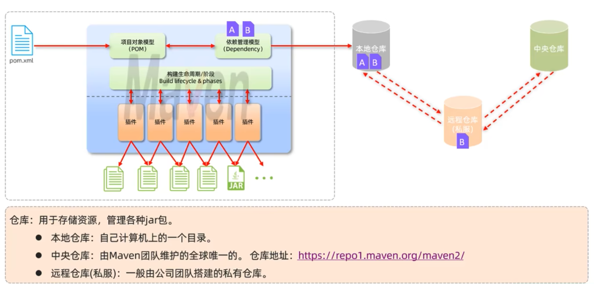

# maven 基础

Maven 是 apache 旗下的一个开源项目，是一款用于管理和构建 java 项目的工具。

> 作用

- 依赖管理: 方便快捷的管理项目依赖的资源(jar 包),避免版本冲突问题
- 统一项目结构: 提供标准,统一的项目结构
- 项目构建: 标准跨平台(window,linux,mac)的自动化项目构建方式



## 1.maven 坐标

- Maven 中的坐标是资源的唯一标识，通过该坐标可以唯一定位资源位置。
- 使用坐标来定义项目或引入项目中需要的依赖。

> Maven 坐标主要组成

- groupId:定义当前 Maven 项目隶属组织名称(通常是域名反写，例如:com.xxx)
- artifactId:定义当前 Maven 项目名称(通常是模块名称，例如 order-service、goods-service)
- version:定义当前项目版本号

```xml
<groupId>org.xxx</groupId>
<artifactId>mavenTest</artifactId>
<version>1.0-SNAPSHOT</version>
```

```xml
<dependency>
  <groupId>ch.qos.logback</groupId>
  <artifactId>logback-classic</artifactId>
  <version>1.2.3</version>
</dependency>
```

## 2.依赖配置

依赖: 指当前项目运行所需要的 jar 包，一个项目中可以引入多个依赖

> 配置

1. 在 pom.xml 中编写 <dependencies>标签
2. 在<dependencies>标签中 使用 <dependency>引入坐标
3. 定义坐标的 groupId, artifactId, version
4. 点击刷新按钮，引入最新加入的坐标

```xml
<dependencies>
    <dependency>
        <groupId>ch.qos.logback</groupId>
        <artifactId>logback-classic</artifactId>
        <version>1.2.3</version>
    </dependency>
</dependencies>
```

## 3. 依赖传递

依赖具有传递性

- 直接依赖:在当前项目中通过依赖配置建立的依赖关系
- 间接依赖:被依赖的资源如果依赖其他资源，当前项目间接依赖其他资源

## 4. 排除依赖

指主动断开依赖的资源,被排除的资源无需指定版本

```xml
<dependencies>
    <dependency>
        <groupId>ch.qos.logback</groupId>
        <artifactId>logback-classic</artifactId>
        <version>1.2.3</version>
        <!-- 排除junit -->
        <exclusions>
            <exclusion>
                <groupId>junit</groupId>
                <artifactId>junit</artifactId>
            </exclusion>
        </exclusions>
    </dependency>
</dependencies>
```

## 5.依赖范围

依赖的 jar 包，默认情况下，可以在任何地方使用。可以通过 `<scope>..</scope＞` 设置其作用范围。

> 作用范围

- 主程序范围有效。(main 文件夹范围内)
- 测试程序范围有效。(test 文件夹范围内)
- 是否参与打包运行。(package 指令范围内)

```xml
<dependencies>
    <dependency>
        <groupId>ch.qos.logback</groupId>
        <artifactId>logback-classic</artifactId>
        <version>1.2.3</version>
        <!-- 作用范围 -->
        <scope>test</scope>
    </dependency>
</dependencies>
```

| scope 值         | 主程序 | 测试程序 | 打包（运行） | 范例        |
| ---------------- | ------ | -------- | ------------ | ----------- |
| compile （默认） | Y      | Y        | Y            | log4j       |
| test             | -      | Y        | -            | junit       |
| provided         | Y      | Y        | -            | servlet-api |
| runtime          | -      | Y        | Y            | jdbc 驱动   |

## 6.生命周期

Maven 的生命周期就是为了对所有的 maven 项目构建过程进行抽象和统一

Maven 中有 3 套相互独立的生命周期:

- clean:清理工作
  - clean：移除上一次构建生成的文件
- default:核心工作，如:编译、测试、打包、安装、部署等
  - compile：编译项目源代码
  - test：使用合适的单元测试框架运行测试(unit)
  - package：将编译后的文件打包，如：jar、war 等
  - install：安装项目到本地仓库
- site:生成报告、发布站点等

在同一套(一共上面 3 套生命周期)什么周期中,当运行后面的阶段时,前面的阶段都会运行

### 6.1 执行生命周期

1. idea 中,右侧工具栏,选中对应的生命周期,双击执行
2. 在命令行中,通过命令执行, mvn xxx(clean,compile...)

### 7.打包插件

```xml
<!--    打包插件    -->
<build>
    <plugins>
        <plugin>
            <groupId>org.apache.maven.plugins</groupId>
            <artifactId>maven-assembly-plugin</artifactId>
            <version>2.4.1</version>
            <configuration>
                <descriptorRefs>
                    <descriptorRef>jar-with-dependencies</descriptorRef>
                </descriptorRefs>
            </configuration>
            <executions>
                <execution>
                    <id>make-assembly</id>
                    <phase>package</phase>
                    <goals><goal>single</goal></goals>
                </execution>
            </executions>
        </plugin>
    </plugins>
</build>
```
