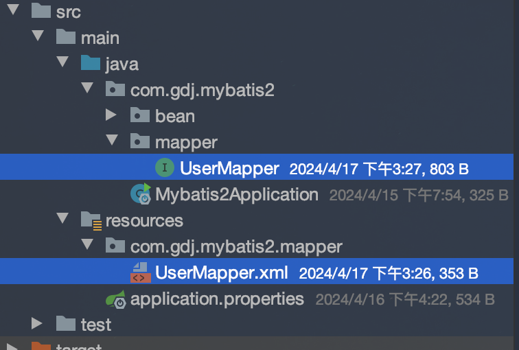

# XML 映射文件

> 规则

- XML 映射文件的名称与 Mapper 接口名称一致，并且将 XML 映射文件和 Mapper 接口放置在相同包下（`同包同名`）
- XML 映射文件的 namespace 属性为 Mapper 接口全限定名一致。
- XML 映射文件中 sql 语句的 id 与 Mapper 接口中的方法名一致，并保持返回类型一致，

使用 Mybatis 的注解,主要是来完成一些简单的增删改查功能.如果需要实现复杂的 SQL 功能,建议使用 XML 来配置映射文件



```java
// UserMapper.java
package com.gdj.mybatis2.mapper;
import org.apache.ibatis.annotations.*;
import com.gdj.mybatis2.bean.User;
import java.time.LocalDate;
import java.util.List;
@Mapper
public interface UserMapper {
  public List<User> list(String name, Integer age, String deptName, LocalDate startTime, LocalDate endTime);
}
```

```xml
<!-- UserMapper.xml -->
<mapper namespace="com.gdj.mybatis2.mapper.UserMapper">
    <select id="list" resultType="com.gdj.mybatis2.bean.User">
        select * from users
        where name like '%${name}%'
          and age >= #{age}
          and dept_name like '%${deptName}%'
        order by id desc
    </select>
</mapper>
```

## IDEA 插件 mybatisx

映射文件跳转
