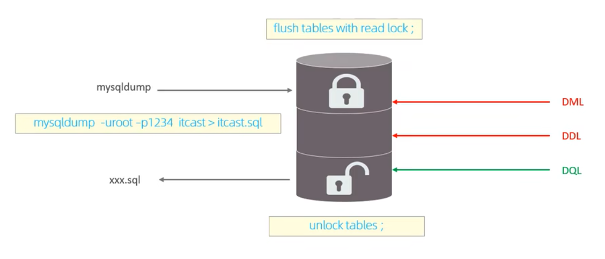

# 锁

锁是计算机协调多个进程或线程并发访问某一资源的机制。在数据库中，除传统的计算资源 (CPU、RAM、1/0)的争用以外，数据也是一种供许多用户共享的资源。如何保证数据并发访问的一致性、有效性是所有数据库必须解决的一个问题，锁冲突也是影响数据库并发访问性能的一个重要因素。从这个角度来说，锁对数据库而言显得尤其重要，也更加复杂。

MySQL 中的锁，按照锁的粒度分，分为以下三类：

1. 全局锁：锁定数据库中的所有表。
2. 表级锁：每次操作锁住整张表。
3. 行级锁：每次操作锁住对应的行数据。

## 1.全局锁

全局锁就是对整个数据库实例加锁，加锁后整个实例就处于`只读状态`，后续的 DML 的写语句，DDL 语句，已经更新操作的事务提交语句都将被阻塞

其典型的使用场景是做`全库的逻辑备份`，对所有的表进行锁定，从而获取一致性视图，保证数据的完整性。



```sql
FLUSH TABLES WITH READ LOCK;

UNLOCK TABLES;

-- 备份
mysqldump -u root -p 1234 Test > test.sql
```

> 特点

数据库中加全局锁，是一个比较重的操作，存在以下问题：

1. 如果在主库上备份，那么在备份期间都不能执行更新，业务基本上就得停摆。
2. 如果在从库上备份，那么在备份期间从库不能执行主库同步过来的二进制日志 (binlog)，会导致主从延迟。

在 InnoDB 引擎中，我们可以在备份时加上参数 --single-transaction 参数来完成不加锁的一致性数据备份。

## 2.表级锁

表级锁，每次操作锁住整张表。锁定粒度大，发生锁冲突的概率最高，并发度最低。应用在 MyISAM、InnoDB、BDB 等存储引擎中。

对于表级锁，主要分为以下三类：

1. 表锁
2. 元数据锁 (meta data lock MDL)
3. 意向锁

### 2.1 表锁

对于表锁，分为两类：

1. 表共享读锁 (read lock)

   客户端 A 加了读锁,所有客户端都可以查,增删改都不能,直到解锁

2. 表独占写锁 (write lock)

   客户端 A 加了写锁,其他客户端都不能增删改查,只有 A 可以增删改查,直到解锁

读锁不会阻塞其他客户端的读，但是会阻塞写。写锁既会阻塞其他客户端的读，又会阻塞其他客户端的写。

> 语法：

```sql
-- 1. 加锁
LOCK TABLES 表名... READ/WRITE;
-- 2. 释放锁
UNLOCK TABLES; -- 客户端断开连接
```

### 2.2 元数据锁 (meta data lock MDL)

MDL 加锁过程是系统自动控制，无需显式使用，在访问一张表的时候会自动加上。MDL 锁主要作用是维护表元数据的数据一致性，在表上有活动事务的时候，不可以对元数据进行写入操作。为了避免 DML 与 DDL 冲突，保证读写的正确性。

在 MySQL5.5 中引入 MDL，当对一张表进行增删改查的时候，加 MDL 读锁(共享)；当对表结构进行变更操作的时候，加 MDL 写锁(排他)。

| 对应 SQL                                       | 锁类型                                  | 说明                                                 |
| ---------------------------------------------- | --------------------------------------- | ---------------------------------------------------- |
| lock tables xxx read / write                   | SHARED_READ ONLY / SHARED NO READ WRITE |                                                      |
| select • select ... lock in share mode         | SHARED_READ                             | 与 SHARED_READ、SHARED_WRITE 兼容，与 EXCLUSIVE 互斥 |
| insert • update, delete, select ... for update | SHARED_WRITE                            | 与 SHARED_READ、SHARED_WRITE 兼容，与 EXCLUSIVE 互斥 |
| alter table ...                                | EXCLUSIVE                               | 与其他的 MDL 都互斥                                  |

> 查看元数据锁

```sql
select object_type,object_schema,object_name, lock_type,lock_duration from performance_schema.metadata_locks;
```

### 2.3 意向锁

为了避免 DML 在执行时，加的行锁与表锁的冲突，在 InnoDB 中引入了意向锁，使得表锁不用检查每行数据是否加锁，使用意向锁来减
少表锁的检查

1. 意向共享锁（IS）：由语句 select ... lock in share mode 添加。

   与表锁共享锁 (read) 兼容,与表锁排它锁 (write) 互斥

2. 意向排他锁 (IX)：由 insert, update, delete, select ... for update 添加。

   与表锁共享锁 (read) 以及 表锁排它锁 (write) 都互斥,意向锁之间不会互斥

> 可以通过以下 SQL，查看意向锁及行锁的加锁情况：

```sql
select object_schema,object_name,index_name,lock_type,lock_mode,lock_data from performance_schema.data_locks;
```

## 3.行级锁

行级锁，每次操作锁住对应的行数据。锁定粒度最小，发生锁冲突的概率最低，并发度最高。应用在 InnODB 存储引擎中。

InnoDB 的数据是基于索引组织的，行锁是通过对索引上的索引项加锁来实现的，而不是对记录加的锁。对于行级锁，主要分为以下三类:

1. 行锁 (Record Lock): 锁定单个行记录的锁，防止其他事务对此行进行 update 和 delete。在 RC、RR 隔离级别下都支持。
2. 间隙锁(Gap Lock): 锁定索引记录间隙(不含该记录)，确保索引记录间隙不变，防止其他事务在这个间隙进行 insert，产生幻读。在 RR 隔离级别下都支持。
3. 临键锁 (Next-key Lock): 行锁和间隙锁组合，同时锁住数据，并锁住数据前面的间隙 Gap。在 RR 隔离级别下支持，

### 3.1 行锁

InnoDB 实现了以下两种类型的行锁:

1. 共享锁(S): 允许一个事务去读一行，阻止其他事务获得相同数据集的排它锁。
2. 排他锁(X): 允许获取排他锁的事务更新数据，阻止其他事务获得相同数据集的共享锁和排他锁。

| 锁类型(行 请求锁类型,列 当前锁类型) | S(共享锁) | X(排它锁) |
| ----------------------------------- | --------- | --------- |
| S(共享锁)                           | 兼容      | 冲突      |
| X(排它锁)                           | 冲突      | 冲突      |

| SQL                           | 行锁类型   | 说明                                        |
| ----------------------------- | ---------- | ------------------------------------------- |
| INSERT...                     | 排他锁     | 自动加锁                                    |
| UPDATE ...                    | 排他锁     | 自动加锁                                    |
| DELETE ...                    | 排他锁     | 自动加锁                                    |
| SELECT (正常)                 | 不加任何锁 |                                             |
| SELECT ... LOCK IN SHARE MODE | 共享锁     | 需要手动在 SELECT 之后加 LOCK IV SHARE MODE |
| SELECT .. FOR UPDATE          | 排他锁     | 需要手动在 SELECT 之后加 FOR UPDATE         |

默认情况下，InnoDB 在 REPEATABLE READ 事务隔离级别运行，InnoDB 使用 next-key 锁进行搜索和索引扫描，以防止幻读。

1. 针对唯一索引进行检索时，对已存在的记录进行等值匹配时，将会自动优化为行锁。
2. InoDB 的行锁是针对于索引加的锁，不通过索引条件检索数据，那么 InnoD 日将对表中的所有记录加锁，此时 `就会升级为表锁`。

### 3.2 间隙锁/临键锁

默认情况下，InnoDB 在 REPEATABLE READ 事务隔离级别运行，InnODB 使用 next-key 锁进行搜索和索引扫描，以防止幻读。

1. 索引上的等值查询(唯一索引)，给不存在的记录加锁时，优化为间隙锁，
2. 索引上的等值查询(普通索引)，向右遍历时最后一个值不满足查询需求时，next-key lock 退化为间隙锁，
3. 索引上的范围查询(唯一索引)--会访问到不满足条件的第一个值为止。

注意：间隙锁唯一目的是防止其他事务插入间隙。间隙锁可以共存，一个事务采用的间隙锁不会阻止另一个事务在同一间隙上采用间隙锁。
