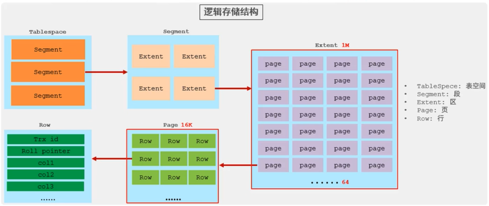

# InnoDB 引擎

## 1.逻辑存储结构



- 表空间(ibd 文件): 一个 mysql 实例可以对应多个表空间,用于存储记录,索引等数据
- 段: 分为数据段 (Leaf node segment)、索引段(Non-leaf node segment )、回滚段 ( Rollback segment) , InnoDB 是索引组织表，数据段就是 B+树的叶子节点，索引段即为 B+树的非叶子节点。段用来管理多个 Extent（区）
- 区: 表空间的单元结构，每个区的大小为 1M。默认情况下，InnoDB 存储引擎页大小为 16K，即一个区中一共有 64 个连续的页
- 页: 是 InnoDB 存储引擎磁盛管理的最小单元，每个页的大小默认为 16KB。为了保证页的连续性，InnoDB 存储引擎每次从磁盘申请 4-5 个区
- 行: InnoDB 存储引擎数据是按行进行存放的

## 2.架构

mysql5.5 版本开始,默认使用 InnoDB 引擎,`擅长事务处理,具有崩溃恢复特性`.

下图是 InnoDB 架构图,`左侧为内存结构,右侧为磁盘结构`


### 2.1 内存结构

1. Buffer Pool

缓冲池是主内存中的一个区域，里面可以缓存磁盘上经常操作的真实数据，在执行增删改查操作时，先操作缓冲池中的数据(若缓冲池没有数据，则从磁盘加载并缓存)，然后再以一定频率刷新到磁盘，从而减少磁盘 IO，加快处理速度。

缓冲池以 Page 页为单位，底层采用链表数据结构管理 Page。根据状态，将 Page 分为三种类型:

- free page: 空闲 page， 未被使用。
- clean page: 被使用 page，数据没有被修改过。
- dirty page: 脏页，被使用 page，数据被修改过，页中数据与磁盘的数据产生了不一致。

2. Change Buffer

更改缓冲区（针对于非唯一二级索引页），在执行 DML 语句时，如果这些数据 Page 没有在 Buffer Pool 中，不会直接操作磁盘，而会将数据变更存在更改缓冲区 Change Buffer 中，在未来数据被读取时，再将数据合井恢复到 Buffer Pool 中，再将合井后的数据刷新到磁盘中。

> Change Buffer 的意义是什么？

与聚集索引不同，二级索引通常是非唯一的，并且以相对随机的顺序插入二级索引。同样，删除和更新可能会影响索引树中不相邻的二级索引页，如果每一次都操作磁盘，会造成大量的磁盘 IO。有了 ChangeBuffer 之后，我们可以在缓冲池中进行合井处理，减少磁盘 IO。

3. Adaptive Hash Index

自适应 hash 索引，用于优化对 Buffer Pool 数据的查询。InnoDB 存储引擎会监控对表上各索引页的查询，如果观察到 hash 索引可以提升速度，则建立 hash 索引，称之为自适应 hash 索引。

自适应哈希索引，无需人工干预，是系统根据情况自动完成。

参数：adaptive_hash_index

4. Log Buffer

日志缓冲区，用来保存要写入到磁盘中的 log 日志数据 (redo log 、undo log)，默认大小为 16MB，日志缓冲区的日志会定期刷新到磁盘中。如果需要更新、插入或删除许多行的事务，增加日志缓冲区的大小可以节省磁盘 I/O。

> 参数

- innodb_log_buffer_size ：缓冲区大小
- innodb_flush_log_at_trx_commit：日志刷新到磁盘时机
  - 1: 日志在每次事务提交时写入井刷新到磁盘
  - 0: 每秒将日志写入井刷新到磁盘一次。
  - 2: 日志在每次事务提交后写入，井每秒刷新到磁盘一次

### 2.2 磁盘结构

1. System Tablespace

系统表空间是更改緩冲区的存储区域。如果表是在系统表空间而不是每个表文件或通用表空间中创建的，它也可能包含表和索引数据。（在 MySQL5.x 版本中还包含 InnoDB 数据字典、undolog 等）

参数：innodb_data_file_path

2. File-Per-Table Tablespaces

每个表的文件表空间包含单个 InnoDB 表的数据和索引，并存储在文件系统上的单个数据文件中。

参数：innodb_file_per_table

3. General Tablespaces

通用表空间，需要通过 CREATE TABLESPACE 语法创建通用表空间，在创建表时，可以指定该表空间。

```sql
CREATE TABLESPACE 表空间名称 ADD
DATAFILE 'file_name'
ENGINE = engine_name;

CREATE TABLE xxx ... TABLESPACE 表空间名称;
```

3. Undo Tablespaces

撒销表空间，MySQL 实例在初始化时会自动创建两个默认的 undo 表空间（初始大小 16M），用于存储 undolog 日志。

4. Temporary Tablespaces

InnoDB 使用会话临时表空间和全局临时表空间。存储用户创建的临时表等数据

5. Doublewrite Buffer Files

双写缓冲区，innoDB 引擎将数据页从 Buffer Pool 刷新到磁盘前，先将数据页写入双写缓冲区文件中，便于系统异常时恢复数据

- ib_16384_0.dblwr
- ib_16384_1.dblwr

6. Redo Log

重做日志，是用来实现事务的持久性。该日志文件由两部分组成：重做日志缓冲(redo log buffer)以及重做日志文件(redo log)，前者是在内存中，后者在磁盛中。当事务提交之后会把所有修改信息都会存到该日志中，用于在刷新脏页到磁盘时,发生错误时，进行数据恢复使用。

以循环方式写入重做日志文件:

- ib_logfile0
- ib_logfile1

### 2.3 后台线程

后台线程将 InnoDB 存储引擎缓冲池的数据在合适的时机刷新到磁盘文件中


1. Master Thread

核心后台线程，负责调度其他线程，还负贵将缓冲池中的数据异步刷新到磁盘中，保持数据的一致性，
还包括脏页的刷新、合井插入缓存、undo 页的回收。

2. IO Thread

在 InnoDB 存储引擎中大量使用了 AIO 来处理 IO 请求，这样可以极大地提高数据库的性能，而 IO
Thread 主要负责这些 IO 请求的回调。

| 线程类型             | 默认个数 | 职责                         |
| -------------------- | -------- | ---------------------------- |
| Road thread          | 4        | 负责读操作                   |
| Write thread         | 4        | 负责写操作                   |
| Log thread           | 1        | 负责将日志缓冲区刷新到磁盘   |
| Insert buffer thread | 1        | 负责将写缓冲区内容刷新到磁盘 |

3. Purge Thread

主要用于回收事务已经提交了的 undo log，在事务提交之后，undo log 可能不用了，就用它来回收。

4. Page Cleaner Thread

协助 Master Thread 刷新脏页到磁盘的线程，它可以减轻 Master Thread 的工作压力，减少阻塞

## 3.事务原理


1. redo log ~ 持久性

重做日志，记录的是事务提交时数据页的物理修改，是用来实现事务的持久性。

该日志文件由两部分组成：重做日志缓冲（redo log buffer）以及重做日志文件(redo log file)，前者是在内存中，后者在磁盘中。当事务提交之后会把所有修改信息都存到该日志文件中，用于在刷新脏页到磁盘，发生错误时，进行数据恢复使用。


2. undo log ~ 原子性

回滚日志，用于记录数据被修改前的信息，作用包含两个：提供回滚 和 MVCC(多版本并发控制)。

undo log 和 redo log 记录物理日志不一样，它是逻辑日志。可以认为当 delete 一条记录时，undo log 中会记录一条对应的 insert 记录，反之亦然，当 update 一条记录时，它记录一条对应相反的 update 记录。当执行 rollback 时，就可以从 undo log 中的逻辑记录读取到相应的内容并进行回滚。

Undo log 销毁：undo log 在事务执行时产生，事务提交时，并不会立即删除 undo log，因为这些日志可能还用于 MVCC.

Undo log 存储：undo log 采用段的方式进行管理和记录，存放在前面介绍的 rollback segment 回滚段中，内部包含 1024 个 undo log segment.

## 4.MVCC 多版本并发控制

1. 当前读

读取的是记录的最新版本，读取时还要保证其他并发事务不能修改当前记录，会对读取的记录进行加锁。对于我们日常的操作，如：select.. lock in share mode(共享锁)，select.. for update、update、insert、delete(排他锁)都是一种当前读。

2. 快照读

简单的 select （不加锁）就是快照读，快照读，读取的是记录数据的可见版本，有可能是历史数据，不加锁，是非阻塞读。

- Read Committed：每次 select，都生成一个快照读。
- Repeatable Read：开启事务后第一个 select 语句才是快照读的地方。
- Serializable：快照读会退化为当前读。

3. MVCC

全称 Multi-Version Concurrency Control，多版本并发控制。指维护一个数据的多个版本，使得读写操作没有冲突，快照读为 MySQL 实现 MVCC 提供了一个非阻塞读功能。MVCC 的具体实现，还需要依赖于数据库记录中的三个隐式字段、undo log 日志、readView。

### 4.1 实现原理

1. 记录中的隐藏字段


| 隐藏字段    | 含义                                                                    |
| ----------- | ----------------------------------------------------------------------- |
| DB_TRX_ID   | 最近修改事务 ID，记录插入这条记录或最后一次修改该记录的事务 ID。        |
| DB_ROLL_PTR | 回滚指针，指向这条记录的上一个版本，用于配合 undo log，指向上一个版本。 |
| DB_ROW_ID   | 隐藏主键，如果表结构没有指定主键，将会生成该隐藏宇段。                  |

2. undo log 版本链

回滚日志，在 insert、update、delete 的时候产生的便于数据回滚的日志。

当 insert 的时候，产生的 undo log 日志只在回滚时需要，在事务提交后，可被立即删除。

而 update、delete 的时候，产生的 undo log 日志不仅在回滚时需要，在快照读时也需要，不会立即被删除。

3. ReadView

ReadView（读视图）是 快照读 SQL 执行时 MVCC 提取数据的依据，记录并维护系统当前活跃的事务（未提交的）id

ReadView 中包含了四个核心字段:

| 字段           | 含义                                                     |
| -------------- | -------------------------------------------------------- |
| m_ids          | 当前活跃的事务 ID 集合                                   |
| min_trx_id     | 最小活跃事务 ID                                          |
| max_trx_id     | 预分配事务 ID，当前最大事务 ID+1（因为事务 ID 是自增的） |
| creator_try_id | ReadView 创建者的事务 ID                                 |

> 版本链数据访问规则

trx_id: 代表是当前事务 ID

- 1.trx_id = creator_trx_id ? 可以访问该版本 => 成立，说明数据是当前这个事务更改的
- 2.trx_id < min_trx_id ? 可以访问该版本 => 成立，说明数据已经提交了
- 3.trx_id > max_trx_id ? **`不可以访问该版本`** => 成立，说明该事务是在 ReadView 生成后才开启
- 4.min_trx_id <= trx_id <= max_trx_id ? 如果 trx_id 不在 m_ids 中是可以访问该版本的 => 成立，说明数据已经提交

> 不同的隔离级别，生成 ReadView 的时机不同:

- READ COMMITTED: 在事务中每一次执行快照读时生成 ReadView。
- REPEATABLE READ: 仅在事务中第一次执行快照读时生成 ReadView，后续复用该 ReadView。

## 总结


