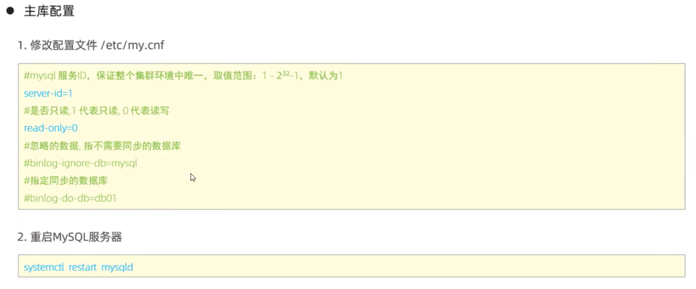

# 主从复制

主从复制是指将主数据库的 DDL 和 DML 操作通过二进制日志传到从库服务器中，然后在从库上对这些日志重新执行（也叫重做），从而使得从库和主库的数据保持同步

MySQL 支持一台主库同时向多台从库进行复制，从库同时也可以作为其他从服务器的主库，实现链状复制。

MysQL 复制的优点主要包含以下三个方面：

1. 主库出现问题，可以快速切换到从库提供服务。
2. 实现读写分离，降低主库的访问压力。
3. 可以在从库中执行备份，以避免备份期问影响主库服务。

主库 Master, 从库 Slave

## 1.原理

从上图来看，复制分成三步：

1. Master 主库在事务提交时，会把数据变更记录在`二进制日志`文件 Binlog 中。
2. 从库读取主库的二进制日志文件 Binlog，写入到从库的中继日志 Relay Log.
3. Slave 重做中继日志中的事件，将改变反映它自己的数据。

## 2.搭建

