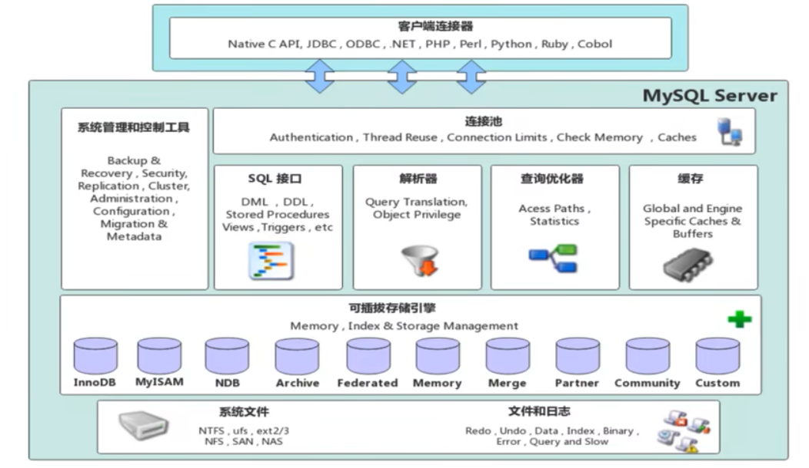

# 存储引擎

## 1.Mysql 体系结构

1. 连接层

最上层是一些客户端和链接服务，主要完成一些类似于连接处理、授权认证、及相关的安全方案。服务器也会为安全接入的每个客户端验证它所具有的操作权限。

2. 服务层

第二层架构主要完成大多数的核心服务功能，如 SQL 接口，并完成缓存的查询，SQL 的分析和优化，部分内置函数的执行。所有跨存储引擎的功能也在这一层实现，如过程、函数等。

3. 引擎层

存储引擎真正的负责了 MySQL 中数据的存储和提取，服务器通过 API 和存储引擎进行通信。不同的存储引擎具有不同的功能，这样我们可以根据自己的需要，来选取合适的存储引擎。

4. 存储层

主要是将数据存储在文件系统之上，并完成与存储引擎的交互。



## 2.存储引擎简介

存储引擎就是存储数据,建立索引,更新/查询数据等技术的实现方式.`存储引擎是基于表的`,而不是基于库的,所以存储引擎也可以被称为`表类型`

默认 InnoDB 引擎

```sql
CREATE TABLE 表名 (
  ...
) ENGINE=InnoDB;

-- 所有引擎
SHOW ENGINES;
```

## 3.存储引擎特点

### 3.1 InnoDB

> 介绍

InnoDB 是一种兼顾高可靠性和高性能的通用存储引擎，在 MySQL 5.5 之后，InnoDB 是默认的 MySQL 存储引擎。

> 特点

- DML 操作遵循 ACID 模型，支持事务；
- 行级锁，提高并发访问性能；
- 支持外键 FOREIGN KEY 约束，保证数据的完整性和正确性;

> 文件

xxx.ibd：xxx 代表的是表名，innoDB 引擎的每张表都会对应这样一个表空间文件，存储该表的表结构(frm、sdi)、数据和索引。

参数：innodb_file_per_table

> 存储区间

表空间 -> 段 -> 区(1M) -> 页(16K) -> 行

### 3.2 MyISAM

是 mysql 早期默认存储引擎

> 特点

- 不支持事务,外键
- 支持表锁,不支持行锁
- 访问速度快

> 文件

- xxx.sdi 存储表结构信息
- xxx.MYD 存储数据
- xxx.MYI 存储索引

### 3.3 Memory

Memory 引擎的表数据是存储在内存中的,由于受到硬件问题,或断电问题的影响,只能将这些表作为临时表或者缓存使用

> 特点

- 内存存放
- hash 索引(默认)

> 文件

- xxx.sdi 存储表结构信息

| 特点         | InnoDB             | MyISAM | Memory |
| ------------ | ------------------ | ------ | ------ |
| 存储限制     | 64TB               | 有     | 有     |
| 事务安全     | 支持               | -      | -      |
| 锁机制       | 行锁               | 表锁   | 表锁   |
| B+tree 索引  | 支持               | 支持   | 支持   |
| Hash 索引    | -                  | -      | 支持   |
| 全文索引     | 支持(5.6 版本之后) | 支持   | -      |
| 空间使用     | 高                 | 低     | N/A    |
| 内存使用     | 高                 | 低     | 中等   |
| 批量插入速度 | 低                 | 高     | 高     |
| 支持外键     | 支持               | -      | -      |

## 4.存储引擎选择

根据应用系统的特点选择合适的存储引擎.对于复杂的应用系统,还可以根据实际情况选择多种存储引擎进行组合.

InnoDB：是 Mysql 的默认存储引擎，支持事务、外键。如果应用对事务的完整性有比较高的要求，在并发条件下要求数据的一致性，数据操作除了插入和查询之外，还包含很多的更新、删除操作，那么 InnoDB 存储引擎是比较合适的选择。

MyISAM ：如果应用是以读操作和插入操作为主，只有很少的更新和删除操作，并且对事务的完整性、 并发性要求不是很高，那么选择这个存储引擎是非常合适的。

MEMORY：将所有数据保存在内存中，访问速度快，通常用于临时表及缓存。MEMORY 的缺陷就是对表的大小有限制，太大的表无法缓存在内存中，而且无法保障数据的安全性。
