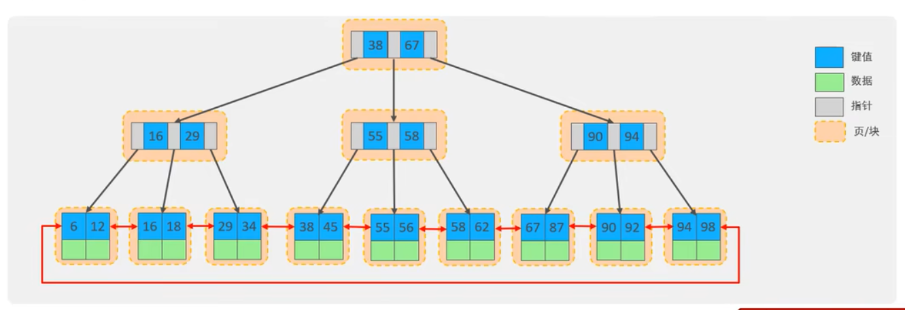

# 索引

索引(index)是帮助 mysql 高效获取数据的数据结构(有序)

> 优点

- 提高数据检索效率,降低数据库的 IO 成本
- 通过索引列对数据进行排序,降低数据排序的成本,降低 CPU 的消耗

> 缺点

- 索引列也是要占用空间的
- 索引打打提高了查询效率,同时也降低更新表的速度,如对表进行增删改是,效率更低

## 1.索引结构

mysql 的索引是在存储引擎实现的,不同的存储引擎有不同的结构.

| 索引结构            | 描述                                                                             |
| ------------------- | -------------------------------------------------------------------------------- |
| `B+Tree 索引`       | `最常见的索引类型，大部分引擎都支持 B+树索引`                                    |
| Hash 索引           | 底层数据结构是用哈希表实现的，只有精确匹配索引列的查询才有效,不支持范围查询      |
| R-tree(空间索引)    | 空间索引是 MyISAM 引擎的一个特殊索引类型，主要用于地理空间数据类型，通常使用较少 |
| Full-text(全文索引) | 是一种通过建立倒排索引,快速匹配文档的方式。类似于 Lucene,Solr,ES                 |

> 通常所说的索引结构指 B+Tree 索引

### 1.1 B+Tree 多路平衡查找树

<a href="https://www.cs.usfca.edu/~galles/visualization/BTree.html">B+tree 树演变</a>

mysql 索引数据结果对经典的 B+Tree 进行了优化,在原树的基础上,增加了指向相邻叶子结点的链表指针,就形成了带有顺序指针的 B+Tree,提高区间访问的性能

以一颗最大度数为 3(3 阶)的 b-tree 为例(每个节点最多存储 2 个 key,3 个指针)



### 1.2 hash 索引

哈希索引就是采用一定的 hash 算法，将键值换算成新的 hash 值，映射到对应的槽位上，然后存储在 hash 表中.

如果两个(或多个)键值，映射到一个相同的槽位上，他们就产生了 hash 冲突（也称为 hash 碰撞），可以通过链表来解决。

> 特点

1. Hash 索引只能用于对等比较(=，in)，不支持范围查询 (between, >, <, ...)
2. 无法利用索引完成排序操作
3. 查询效率高，通常只需要一次检索就可以了，效率通常要高于 B+tree 索引

在 MysQL 中，支持 hash 索引的是 Memory 引擎，而 InnoDB 中具有自适应 hash 功能，hash 索引是存储引擎根据 B+Tree 索引在指定条件下自动构建的。

## 2.索引分类

| 分类     | 含义                                                 | 特点                     | 关键字   |
| -------- | ---------------------------------------------------- | ------------------------ | -------- |
| 主键索引 | 针对于表中主键创建的索引                             | 默认自动创建，只能有一个 | PRIMARY  |
| 唯一索引 | 避免同一个表中某数据列中的值重复                     | 可以有多个               | UNIQUE   |
| 常规索引 | 快速定位特定数据                                     | 可以有多个               |          |
| 全文索引 | 全文索引查找的是文本中的关键词，而不是比较索引中的值 | 可以有多个               | FULLTEXT |

> InnoDB 的索引存储形式

| 分类                      | 含义                                                       | 特点                |
| ------------------------- | ---------------------------------------------------------- | ------------------- |
| 聚集索引(clustered Index) | 将数据存储与索引放到了一块，索引结构的叶子节点保存了行数据 | 必须有,而且只有一个 |
| 二级索引(Secondary Index) | 将数据与索引分开存储，索引结构的叶子节点关联的是对应的主键 | 可以存在多个        |

> 聚集索引选取规则

- 如果存在主键，主键索引就是聚集索引。
- 如果不存在主键，将使用第一个唯一 (UNIQUE)索引作为聚集索引。
- 如果表没有主键，或没有合适的唯一索引，则 InnoDB 会自动生成一个 rowid 作为隐藏的聚集索引。


> 回表查询

查询 name = 'Arm',先从`二级索引`根据名称首字母查找到 Arm 的 id 10,在回到聚集索引通过 id 查询对应的数据 row


## 3.索引语法

### 3.1 创建索引 (单列索引和联合索引)

```sql
CREATE [ UNIQUE | FULLTEXT ] INDEX index_name ON table_name (index_col_name,...);

-- name字段为姓名字段，该字段的值可能会重复，为该宇段创建`单列索引`。
-- CREATE INDEX idx_user_name on `user`(name);

-- 为profession、age、status创建`联合索引`。
-- CREATE UNIQUE INDEX idx_user_pro_age_sta on user(profession, age, status);
```

### 3.2 查看索引

```sql
SHOW INDEX FROM table_name;
```

### 3.3 删除索引

```sql
DROP INDEX index_name ON table_name;
```

## 4.sql 性能分析

### 4.1 sql 执行频率

MysQL 客户端连接成功后，通过 show session[global] status 命令可以提供服务器状态信息。通过如下指令，可以查看当前数据库的 INSERT. UPDATE, DELETE SELECT 的访问频次

```sql
SHOW GLOBAL STATUS LIKE 'Com_______';
```

### 4.2 慢查询日志

慢查询日志记录了所有执行时间超过指定参数 (long_query_time，单位：秒，默认 10 秒）的所有 SQL 语句的日志.

MySQL 的慢查询日志默认没有开尾，需要在 MySQL 的配置文件（/etc/my.cnf) 中配置如下信息：

```sql
-- 方法1

# 开启MySQL慢日志查询开关
slow_query_log = 1
# 设置慢日志的时间为2秒，SQL语句执行时间超过2秒，就会视为慢查询，记录慢查询日志
long_query_time = 2

-- 方法2 执行sql语句

SET GLOBAL slow_query_log = 'ON';
SET GLOBAL long_query_time = 2;

-- 显示和slow相关的字段
SHOW VARIABLES LIKE '%slow%';
```

配置完毕之后，通过以下指令重新启动 MySQL 服务器进行测试，查看慢日志文件中记录的信息 /var/lib/mysql/localhost-slow.log

### 4.3 profile 详情

show profiles 能够在做 SQL 优化时帮助我们了解时间都耗费到哪里去了。通过 have_profiling 参数，能够看到当前 MySQL 是否支持 profile 操作:

```sql
SELECT @@have_profiling;
```

默认 profiling 是关闭的，可以通过 set 语句在 session/global 级别开启 profiling:

```sql
SELECT @@profiling;

SET profiling = 1:
```

执行一系列的业务 SQL 的操作，然后通过如下指令查看指令的执行耗时：

1. 查看每一条 SQL 的耗时基本情况

```sql
SHOW PROFILES;
```

2. 查看指定 query_id 的 SQL 语句各个阶段的耗时情况

```sql
SHOW PROFILE FOR QUERY query_id;
```

3. 查看指定 query_id 的 SQL 语句 CPU 的使用情况

```sql
SHOW PROFILE CPU FOR QUERY query_id;
```

### 4.4 explain 执行计划

EXPLAIN 或者 DESC 命令获取 MySQL 如何执行 SELECT 语句的信息，包括在 SELECT 语句执行过程中表如何连接和连接的顺序。

> 语法

```sql
＃直接在select语句之前加上关键字 EXPLAIN / DESC
EXPLAIN SELECT 字段列表 FROM 表名 WHERE 条件，
```


> 各字段的含义

- id: select 查询的序列号,表示已查询章执行 select 子句或者是操作表的顺序(id 相同,执行顺序从上到下; id 不同,值越大,越先执行)
- select_type: 表示 SELECT 的类型,常见的取值有 SIMPLE(简单表,即不使用表连接或者子查询),PRIMARY(主查询,即外层的查询)
- type: 表示连接类型,性能由好到差的连接类型为 NULL,system,const,eq_ref,ref,range,index,all
- possible_keys: 显示可能应用在这张表上的索引,一个或多个
- key: 实际用到的索引,如果为 NULL,则没有索引
- key_len: 表示索引中使用的字节数,该值为所有字段最大可能长度,并非实际使用长度,在不损失精确性的前提下,长度越短越好
- ref
- rows: mysql 认为必须要执行查询的行数,在 InnoDB 引擎的表中,是一个估计值,可能并不总是准确的
- filtered: 表示返回结果的行数占所需读取行数的百分比,值越大越好
- Extra:
  - using index condition: 查找使用了索引，但是需要回表查询数据
  - using where; using index: 查找使用了索引，但是需要的数据都在索引列中能找到，所以不需要回表查询数据

## 5.索引使用

### 5.1 最左前缀法则

如果索引了多列(联合索引)，要遵守最左前缀法则。最左前缀法则指的是查询从索引的最左列开始，并且不跳过索引中的列。

如果跳跃某一列，索引将部分失效(后面的字段索引失效)。

### 5.2 范围查询

联合索引中,出现范围查询(>, <),范围查询右侧的列索引失效

### 5.3 索引列运算

不要在索引列上进行运算操作,索引将失效

### 5.4 字符串不加引号

字符串类型字段使用时,不加引号,索引将失效

### 5.5 模糊查询

如果仅仅是尾部模糊匹配,索引不会失效.如果是头部模糊匹配,索引失效

### 5.6 or 连接的条件

用 or 分割开的条件,如果 or 前的条件中的列有索引,而后面的列中没有索引,那么涉及的索引都不会被用到

### 5.7 数据分布影响

如果 mysql 评估使用索引比全表更慢,则不使用索引

是否使用索引取决于字段条件在表中的分布情况

### 5.8 SQL 提示

SQL 提示,是优化数据库的一个重要手段,简单来说,就是在 SQL 语句中加入一些认为的提示来达到优化操作的目的

```sql
USE INDEX(index_name) -- 建议使用当前索引
IGNORE INDEX(index_name) -- 忽略当前索引
FORCE INDEX(index_name) -- 强制使用当前索引

SELECT * FROM user USE INDEX(idx_user_pro) WHERE id = '1';
```

### 5.9 覆盖索引

尽量使用覆盖索引(查询使用了索引,并且需要返回的列,在该索引中已经全部能够找到,减少 select \*)

### 5.10 前缀索引

解决长文本,大字符串查询的

当字段类型为宇符串(varchar, text 等)时，有时候需要索引很长的字符串，这会让索引变得很大，查询时，浪费大量的磁盘 IO，影响查询效率。此时可以只将字符串的一部分前缀，建立索引，这样可以大大节约索引空间，从而提高索引效率.

> 语法

```sql
create index idx xxxx on table name(column(n)) :
```

> 前缀长度

可以根据索引的选择性来决定，而选择性是指不重复的索引值(基数)和数据表的记录总数的比值，索引选择性越高则查询效率越高，唯一索引的选择性是 1，这是最好的索引选择性，性能也是最好的。

```sql
select count(distinct email) / count(*) from tb user;
select count(distinct substring(email,1,5)) / count(*) from tb user :
```

### 5.11 单列索引和联合索引

- 单列索引: 一个索引只包含单个列
- 联合索引: 一个索引包含了多个列

```sql
-- `单列索引` name 字段
-- CREATE INDEX idx_user_name on `user`(name);

-- `联合索引` profession、age、status 字段
-- CREATE UNIQUE INDEX idx_user_pro_age_sta on user(profession, age, status);
```

在业务场景中,如果存在多个查询条件,考虑针对查询字段建立索引时,建议建立联合索引,而非单列索引

## 6.索引设计原则

1. 针对于数据量较大，且查询比较频繁的表建立索引。
2. 针对于常作为查询条件(where)、排序 (order by)、分组（group by）操作的字段建立索引。
3. 尽量选择区分度高的列作为索引，尽量建立唯一索引，区分度越高，使用索引的效率越高。
4. 如果是字符串类型的宇段，宇段的长度较长，可以针对于字段的特点，建立前缀索引。
5. 尽量使用联合索引，减少单列索引，查询时，联合索引很多时候可以覆盖索引，节省存储空问，避免回表，提高查询效率。
6. 要控制索引的数量，索引并不是多多益善，索引越多，维护索引结构的代价也就越大，会影响增删改的效率。
7. 如果索引列不能存储 NULL 值，请在创建表时使用 NOT NULL 约束它。当优化器知道每列是否包含 NULL 值时，它可以更好地确定哪个索引最有效地用于查询。
