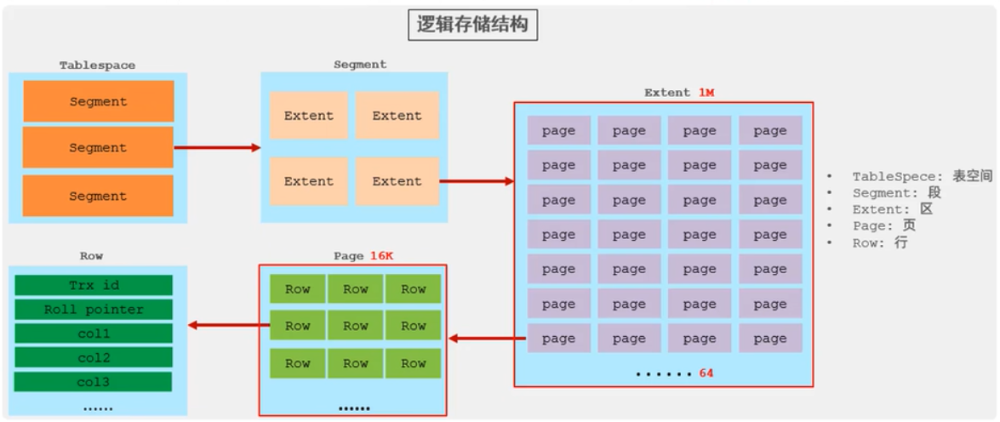
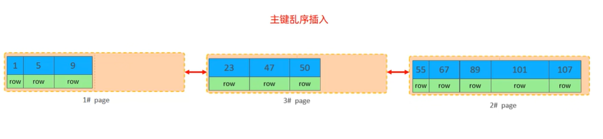
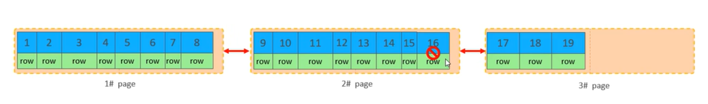
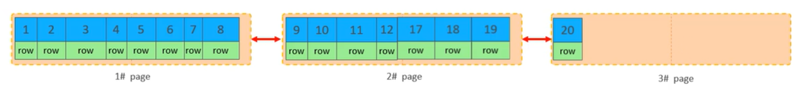

# sql 优化

## 1.插入数据

1. 批量插入
2. 手动事务提交
3. 主键顺序插入

## 1.1 大批量插入数据 load

如果一次性需要插入大批量数据,使用 insert 语句插入性能较低,此时使用 mysql 数据库提供的 `load` 指令进行插入

```sql
#客户端连接服务端时，加上参数 --local-infile
mysql --local-infile -u root -p
#设置全局参数local_infile为1，开启从本地加载文件导入数据的开关
set global local_infile = 1;
#执行load指令将准备好的数据，加载到表结构中
load data local infile '/root/xxx.sql' into table tb_user fields terminated by ',' lines terminated by '\n':

-- 文件 xxx.sql 内容如下 ','是分隔符
-- 1,xxx1,yyy,zzz,2020-10-10,1
-- 2,xxx2,yyy,zzz,2020-10-10,1
-- 3,xxx3,yyy,zzz,2020-10-10,1
-- 4,xxx4,yyy,zzz,2020-10-10,1
```

## 2.主键优化

> 数据组织方式: 在 InnoDB 存储引擎中,`表数据都是根据主键顺序组织存放的`,这种存储方式的表称为`索引组织表(IOT ~ index organized table)`



### 2.1 页分裂

页可以为空,也可以填充一半,也可以填充 100%.每个也包含了 2-N 行数据(如果一行数据过大,会行溢出),根据主键排列



### 2.2 页合并

当删除一行记录时，实际上记录并没有被物理删除，只是记录被标记 (flaged)为删除并且它的空间变得允许被其他记录声明使用。

当页中删除的记录达到 MERGE_THRESHOLD (默认为页的 50%)，InnoDB 会开始寻找最靠近的页(前或后)看看是否可以将两个页合并以优化空间使用。



删除 id 13,14,15,16 后达到 MERGE_THRESHOLD 会触发页合并



> `MERGE_THRESHOLD`: 合并页的阈值,可以自己设置,在创建表或者创建索引时指定

### 2.3 主键设计原则

1. 满足业务需求的情况下，尽量降低主键的长度。
2. 插入数据时，尽量选择顺序插入，选择使用 AUTO_INCREMENT 自增主键。
3. 尽量不要使用 UUID 做主键或者是其他自然主键，如身份证号。
4. 业务操作时，避免对主键的修改。

## 3.order by 优化

1. Using filesort ：通过表的索引或全表扫描，读取满足条件的数据行，然后在排序缓冲区 sort buffer 中完成排序操作，所有不是通过索引直接返回排序结果的排序都叫 FileSort 排序。
2. Using index：通过有序索引顺序扫描直接返回有序数据，这种情况即为 using index，不需要额外排序，操作效率高

## 4.group by 优化

1. 分组操作时,可以通过索引来提交效率
2. 分组操作时,索引的使用也是满足最左前缀法则的

## 5.limit 优化

limit 越往后越耗时, 覆盖索引+子查询

一个常见又非常头疼的问题就是 limit 2000000,10 ，此时需要 MySQL 排序前 2000010 记录，仅仅返回 2000000- 2000010 的记录，其他记录丢弃，查询排序的代价非常大。

优化思路：一般分页查询时，通过创建 覆盖索引能够比较好地提高性能，可以通过覆盖索引加子查询形式进行优化。

```sql
explain select * from user, (select id from user order by id limit 2000000,10) a where t.id = a.id;
```

## 6.count 优化

```sql
explain select count(*) from user :
```

- MyISAM 引擎把二个表的总行数存在了磁盘上，因此执行 Count(\*)的时候会直接返回这个数，效率很高
- InnoDB 引擎就麻烦了，它执行 count(\*)的时候，需要把数据一行一行地从引擎里面读出来，然后累积计数。

> 优化思路：自己计数

> 用法: count(\*), count(主键), count(字段), count(1)

- count （主键）

InnoDB 引擎会遍历整张表，把每一行的 主键 id 值都取出来，返回给服务层。服务层拿到主键后，直接按行进行累加(主键不可能为 null)。

- count（字段）

没有 not null 约束：InnoDB 引擎会遍历整张表把每一行的字段值都取出来，返回给服务层，服务层判断是否为 null，不为 null，计数累加。
有 not null 约束：InnoDB 引擎会遍历整张表把每一行的字段值都取出来，返回给服务层，直接按行进行累加。

- count (1)

InnoDB 引擎遍历整张表，但不取值。服务层对于返回的每一行，放一个数字“1〞进去，直接按行进行累加。 (1 可以是随便一个数字,结果都一样)

- count (\*)

InnoDB 引擎并不会把全部字段取出来，而是专门做了优化，不取值，服务层直接按行进行累加。

> 按照效率排序的话，count(字段)＜ count(主键 id) < count(1) ≈ count(\*)，所以尽量使用 count(\*)

## 7.update 优化

使用索引

尽量根据主键/索引字段进行数据更新
