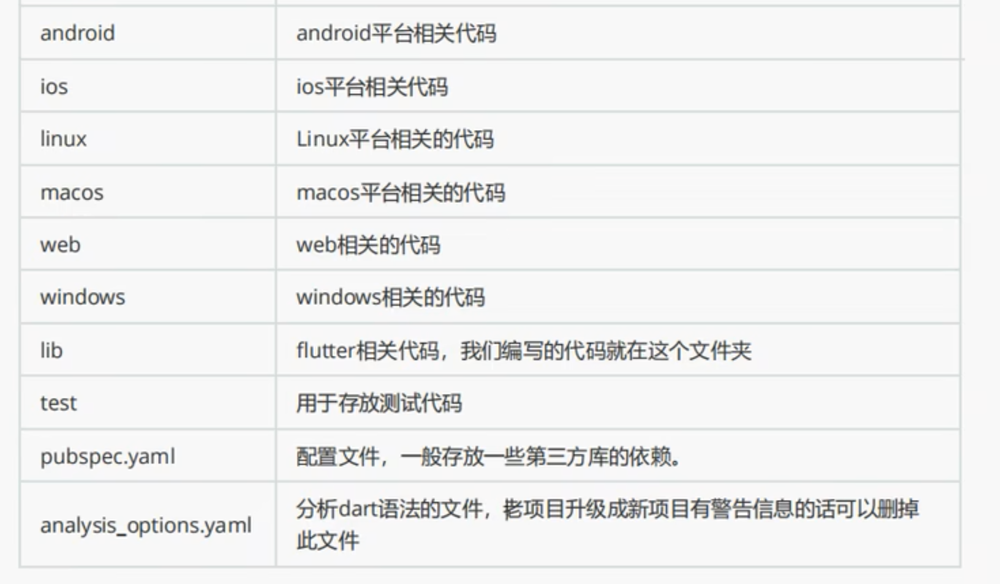

# 0. 配置/安装 Flutter

## 0.1 mac 安装

### 0.1.1 安装dart

```
brew tap dart-lang/dart

brew install dart
```

### 0.1.2 安装Flutter

1. Flutter extension for VS Code。
2. 启动 VS Code
3. 打开 命令面板 (Command Palette)，按下快捷键 Command + Shift + P
4. 在 命令面板 (Command Palette) 中输入 flutter
5. 选择 Flutter: New Project。
6. VS Code 会提示你在计算机上找到 Flutter SDK。
    1. 如果你已经安装 Flutter SDK，请单击 Locate SDK。
    2. 如果你没有安装 Flutter SDK, 请单击 Download SDK。
    3. 如果你没有按照 开发工具的必要条件 安装 Git ，单击该按钮后会导航至 Flutter 安装页面。
7. 当提示 Which Flutter template? 的时候，请忽略它。可以按下 Esc。你可以在检查完开发配置后创建初始测试项目。
8. flutter doctor 监测环境是否安装完整

### 0.1.3 创建项目

1. 启动 Visual Studio Code 并打开命令面板（使用 `F1`、`Ctrl+Shift+P` 或 `Shift+Cmd+P`）。开始输入“`flutter new`”。选择 `Flutter: New Project` 命令。
2. 接下来，选择 Application，然后选择要在哪个文件夹中创建项目。这可以是您的主目录，或类似于 C:\src\ 的目录。
3. 最后，为项目命名。比如说，命名为 namer_app 或 my_awesome_namer。

### 1.1.4 修改文件

1. 修改 pubspec.yaml 项目依赖文件
```yaml
name: namer_app
description: A new Flutter project.

publish_to: 'none' # Remove this line if you wish to publish to pub.dev

version: 0.0.1+1

environment:
  sdk: '>=2.19.4 <4.0.0'

dependencies:
  flutter:
    sdk: flutter

  english_words: ^4.0.0
  provider: ^6.0.0

dev_dependencies:
  flutter_test:
    sdk: flutter

  flutter_lints: ^2.0.0

flutter:
  uses-material-design: true
```

2. 修改 analysis_options.yaml
```yaml
include: package:flutter_lints/flutter.yaml

linter:
  rules:
    prefer_const_constructors: false
    prefer_final_fields: false
    use_key_in_widget_constructors: false
    prefer_const_literals_to_create_immutables: false
    prefer_const_constructors_in_immutables: false
    avoid_print: false
```

3. 修改 lib/main.dart 文件
```dart
import 'package:english_words/english_words.dart';
import 'package:flutter/material.dart';
import 'package:provider/provider.dart';

void main() {
  runApp(MyApp());
}

class MyApp extends StatelessWidget {
  const MyApp({super.key});

  @override
  Widget build(BuildContext context) {
    return ChangeNotifierProvider(
      create: (context) => MyAppState(),
      child: MaterialApp(
        title: 'Namer App',
        theme: ThemeData(
          useMaterial3: true,
          colorScheme: ColorScheme.fromSeed(seedColor: Colors.deepOrange),
        ),
        home: MyHomePage(),
      ),
    );
  }
}

class MyAppState extends ChangeNotifier {
  var current = WordPair.random();
}

class MyHomePage extends StatelessWidget {
  @override
  Widget build(BuildContext context) {
    var appState = context.watch<MyAppState>();

    return Scaffold(
      body: Column(
        children: [
          Text('A random idea:'),
          Text(appState.current.asLowerCase),
        ],
      ),
    );
  }
}
```

启动

4. 目录结构


## 0.2 Flutter命令

1.flutter create app_01 ：创建一个新的Flutter项目

2.flutter run：运行应用程序

3.flutter run -d <deviceId>：运行指定模拟器或者真机

4.flutter devices：查看计算机上的真机设备和IOS模拟器

5.flutter emulators：获取模拟器设备列表

6.flutter doctor：检查flutter开发环境是否正确及提供修复建议

7.flutter pub get：从pub.dev 下载依赖项。将读取pubspec.yaml文件，并下载所指定的依赖

8.flutter pub upgrade：更新项目中的依赖

9.flutter clean：清除项目的构建缓存，删除所有构建输出，并重建项目

10.flutter build ap：安卓打包

11.flutter build ios --release ：IOS打包

12.flutter build appbundle ：打aab包

13.flutter build apk --target-platform android-arm,android-arm64：打指定 arm arm64的包

14.flutter run -d all：运行所有模拟器（启动完了再运行）

15.flutter channel：查看flutter sdk 分支

16.flutter channel stable：切换sdk分支到stable

17.flutter 获取所有指令

18.flutter analye：分析代码

19.flutter -h：查看命令帮助信息

20.flutter --version：查看当前Flutter版本

21.flutter pub outdated：判断那些过时了的package 依赖以及获取更新建议

22.flutter upgrade v2.2.3：升级到flutter指定版本

23.flutter downgrade v2.0.3：回退到flutter指定版本

24.flutter emulator --launch 模拟器名称 ：启动本机的模拟器

25.r键：热重载

26.R键：重新启动

27.q键：退出

28.p：显示网络

29.P：显示帧率

30.o：切换Android与iOS的预览模式


## 0.3 app网络配置

```
cd /Users/gudongjie/Library/Android/sdk/emulator

./emulator @模拟器名称 -dns-server 8.8.8.8,114.114.114.114
./emulator @Pixel_8_API_34 -dns-server 8.8.8.8,114.114.114.114
```

```
adb -s 模拟器名称 forward tcp:<模拟器端口号> tcp:<本地服务器端口号>
adb -s emulator-5554 forward tcp:9999 tcp:9999
```

