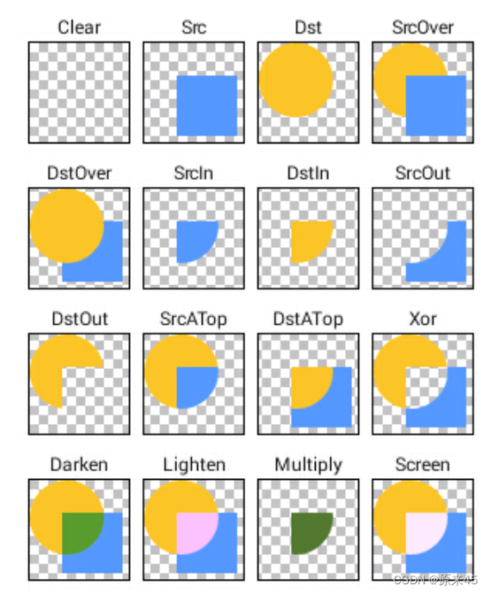

## 5.1 Image

Image 是一个图像的 Widget ，提供了一些类方法来快捷使用来自内存、本地、网络、Assets 的图片

```dart
//通过ImageProvider来加载图片
const Image({
    Key key,
    // ImageProvider，图像显示源
    @required this.image,
    this.semanticLabel,
    this.excludeFromSemantics = false,
    //显示宽度
    this.width,
    //显示高度
    this.height,
    //图片的混合色值
    this.color,
    //混合模式
    this.colorBlendMode,
    //缩放显示模式
    this.fit,
    //对齐方式
    this.alignment = Alignment.center,
    //重复方式
    this.repeat = ImageRepeat.noRepeat,
    //当图片需要被拉伸显示的时候，centerSlice定义的矩形区域会被拉伸，类似.9图片
    this.centerSlice,
    //类似于文字的显示方向
    this.matchTextDirection = false,
    //图片发生变化后，加载过程中原图片保留还是留白
    this.gaplessPlayback = false,
    //图片显示质量
    this.filterQuality = FilterQuality.low,
  })

// 加载网络图片，封装类：NetworkImage
Image.network(
    //路径
    String src,
   {
    Key key,
    //缩放
    double scale = 1.0,
    this.semanticLabel,
    this.excludeFromSemantics = false,
    this.width,
    this.height,
    this.color,
    this.colorBlendMode,
    this.fit,
    this.alignment = Alignment.center,
    this.repeat = ImageRepeat.noRepeat,
    this.centerSlice,
    this.matchTextDirection = false,
    this.gaplessPlayback = false,
    this.filterQuality = FilterQuality.low,
    Map<String, String> headers,
  })

// 加载本地File文件图片，封装类：FileImage
Image.file(
    //File对象
    File file,
  {
    Key key,
    double scale = 1.0,
    this.semanticLabel,
    this.excludeFromSemantics = false,
    this.width,
    this.height,
    this.color,
    this.colorBlendMode,
    this.fit,
    this.alignment = Alignment.center,
    this.repeat = ImageRepeat.noRepeat,
    this.centerSlice,
    this.matchTextDirection = false,
    this.gaplessPlayback = false,
    this.filterQuality = FilterQuality.low,
  })

// 加载本地资源图片,例如项目内资源图片
// 需要把图片路径在pubspec.yaml文件中声明一下，如：
// assets:
//      - packages/fancy_backgrounds/backgrounds/background1.png
// 封装类有：AssetImage、ExactAssetImage
Image.asset(
    //文件名称，包含路径
    String name,
  {
    Key key,
    // 用于访问资源对象
    AssetBundle bundle,
    this.semanticLabel,
    this.excludeFromSemantics = false,
    double scale,
    this.width,
    this.height,
    this.color,
    this.colorBlendMode,
    this.fit,
    this.alignment = Alignment.center,
    this.repeat = ImageRepeat.noRepeat,
    this.centerSlice,
    this.matchTextDirection = false,
    this.gaplessPlayback = false,
    String package,
    this.filterQuality = FilterQuality.low,
  })

// 加载Uint8List资源图片/从内存中获取图片显示
// 封装类：MemoryImage
Image.memory(
    // Uint8List资源图片
    Uint8List bytes,
  {
    Key key,
    double scale = 1.0,
    this.semanticLabel,
    this.excludeFromSemantics = false,
    this.width,
    this.height,
    this.color,
    this.colorBlendMode,
    this.fit,
    this.alignment = Alignment.center,
    this.repeat = ImageRepeat.noRepeat,
    this.centerSlice,
    this.matchTextDirection = false,
    this.gaplessPlayback = false,
    this.filterQuality = FilterQuality.low,
  })
```

> 枚举 BlendMode 定义

```dart
enum BlendMode {
  clear,src,dst,srcOver,dstOver,srcIn,dstIn,srcOut,dstOut,srcATop,dstATop,xor,plus，modulate,screen,overlay,darken,lighten,colorDodge,colorBurn,hardLight,softLight,difference,exclusion,multiply,hue,saturation,color,luminosity,
}
```



## 5.2 图标组件 Icon

Icon 组件用来显示可缩放的图标，不会像图片一样失真，还能设置颜色

```dart
  const Icon(
    // IconData 图标数据
    this.icon, {
    Key? key,
    // 尺寸
    this.size,
    // 颜色
    this.color,
    // 方向
    this.textDirection,
    this.semanticLabel,
  }) : super(key: key);
```

> 开启 pubspec.yaml

```yaml
# The following section is specific to Flutter.
flutter:
  # The following line ensures that the Material Icons font is
  # included with your application, so that you can use the icons in
  # the material Icons class.
  uses-material-design: true
```

> demo

```dart
class MyImage extends StatelessWidget {
  const MyImage({Key? key}) : super(key: key);

  @override
  Widget build(BuildContext context) {
    return Column(
      children: [
        Image.asset(
          AssetsImages.iconSuccessPng,
          width: 50,
          // color: Colors.red,
        ),
        Container(
          width: 200,
          height: 200,
          color: Colors.red,
          child: Image.network(
            AssetsImages.iconUrl1,
            width: 100,
            colorBlendMode: BlendMode.dstOver,
          ),
        ),
        Icon(
          Icons.campaign,
          size: 200,
          color: Colors.amber,
        )
      ],
    );
  }
}
```
